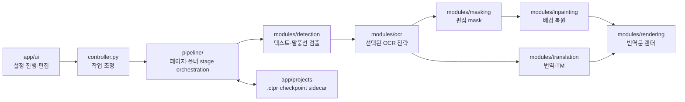

# Comic Translate 코드 구조와 OCR 전략 경계

이 문서는 제품 코드의 책임과 OCR 세 경로의 import 경계를 설명하는 기준 문서다.
벤치마크 순위·후보 선택·원시 결과는 제품 코드에 넣지 않고
`benchmarking/lab`과 Git 외부 validation 폴더에서 관리한다.

## 전체 실행 흐름

Stage-Batched 자동 처리는 각 GPU 모델을 동시에 상주시켜 처리하지 않는다.
OCR 폴더 stage가 끝나면 OCR runtime을 멈추고 VRAM 반환을 확인한 뒤
Gemma와 inpainter를 순서대로 실행한다.

## Stage-Batched 파이프라인 작동 원리

Stage-Batched는 폴더나 아카이브의 모든 선택 페이지를 한 단계씩 묶어 처리한다.
페이지 하나에서 OCR부터 렌더까지 끝낸 뒤 다음 페이지로 가는 legacy workflow와
달리, GPU 모델을 단계 경계에서 명시적으로 교대해 같은 GPU에 여러 대형 모델이
동시에 올라가지 않게 하는 것이 핵심이다.

`stage_batched_pipeline`을 선택하면 페이지 수나 전체 예상 메모리와 관계없이
`StageBatchedProcessor`가 실행된다. 이미지 hard cap과 단일 페이지 RAM 검사는
입력 안전성만 판단하며 workflow를 legacy로 바꾸지 않는다.

1. 설치 상태와 선택 모델을 검사한다. 앱은 여기서 모델, image, volume을
   다운로드하거나 복구하지 않는다.
2. 검출 중에는 OCR Router **컨테이너만** 미리 시작할 수 있다.
   `--no-models-autoload`이므로 이때 GPU OCR 모델은 아직 올라가지 않는다.
3. `detect-all`이 모든 페이지의 텍스트 영역을 검출한다.
4. 검출이 끝나면 OCR 모델을 준비하고 `ocr-all`이 모든 페이지를 처리한다.
5. OCR sweep 종료 후 요청을 drain하고 OCR instance를 unload한다. GPU lease와
   반환 확인을 통과한 뒤에만 Gemma 적재로 넘어간다.
6. `translate-all`이 전체 페이지의 번역 대상 block을 처리한다. result cache와
   승인형 Exact TM이 전체 hit이면 Gemma 자체를 시작하지 않을 수 있다.
7. 번역 종료 후 Gemma를 unload하고 Router container를 멈춰 CUDA context까지
   inpainter에 넘긴다.
8. `inpaint-all`이 원문 영역을 복원하고, 이어서 `render-all`이 번역문을
   렌더링한다.
9. checkpoint와 지연된 자동 저장을 반영하고 페이지 buffer를 해제한다.

### OCR 중 Gemma 준비가 보이는 이유

OCR sweep과 겹쳐 실행되는 Gemma 준비에는 서로 다른 두 종류가 있다.

- **page-cache prefetch**: GGUF를 디스크에서 WSL/Linux RAM page cache로 읽는다.
  GPU model lease를 잡지 않으며 OCR VRAM과 동시에 상주하는 기능이 아니다.
- **Gemma model prewarm**: OCR이 완전히 unload된 handoff 이후에만 실제 CUDA
  모델을 적재한다.

prefetch는 최적화일 뿐 필수 단계가 아니다. 현재 가용 WSL RAM이 14.6GB 모델
크기보다 작으면 안전하게 건너뛴다. 이 경우 번역 단계의 cold load가 느려질 수
있지만 workflow 순서나 번역 결과가 바뀌지는 않는다.

`Gemma 예열 실패. 해당 단계에서 다시 준비합니다.` 같은 메시지는 선택적인
비동기 prewarm이 끝나지 않았거나 실패해 번역 단계에서 동기 적재를 한 번
시도한다는 뜻이다. 최종 동기 적재까지 실패했을 때만 배치 실패다.

### shared llama.cpp Router

관리형 PaddleOCR VL, PaddleOCR VL Spotting, HunyuanOCR, MangaLMM은 Gemma와 한
Router container를 공유할 수 있다. 이것은 두 모델을 동시에 올린다는 뜻이
아니다.

- Router는 `--models-max 1`과 `--no-models-autoload`로 시작한다.
- OCR 단계에는 선택 OCR instance 하나만 적재한다.
- handoff에서 OCR을 unload하고 zero-loaded 상태를 확인한다.
- 번역 단계에는 Gemma instance 하나만 적재한다.
- 같은 GPU model lease가 동시에 두 서비스에 발급되면 계약 위반이다.

따라서 HunyuanOCR가 lease를 쥔 상태에서 Gemma를 시작하려는 로그가 보이면 정상
Stage-Batched handoff가 아니라 workflow routing 또는 release 회귀를 의심해야
한다.

### 메모리와 GPU layer의 관계

Stage-Batched 순서는 GPU layer 수와 독립적이다. `LLAMA_N_GPU_LAYERS`는 Gemma의
몇 개 layer를 CUDA에 둘지만 정하며 `detect-all → ocr-all → translate-all →
inpaint-all → render-all` 순서를 바꾸지 않는다.

- host/WSL RAM: GGUF mmap, page cache, cold-load 시간에 영향
- swap: RAM 압박 시 실패 완화에 도움을 줄 수 있지만 속도 저하 가능
- VRAM: GPU layer, KV cache, compute buffer 적재 가능 여부를 결정
- Windows WDDM 점유: 같은 12GB GPU에서도 실행마다 가용 연속 VRAM을 바꿀 수 있음

12GB GPU의 layer 선택과 standalone/Router 수동 조정은
[Gemma 로컬 서버 설정 가이드](../gemma/local-server-ko.md#12gb-vram-환경과-gpu-layer-수동-조정)를
참고한다.

정상 실행에서는 `detect-all → ocr-all → OCR-to-translate handoff →
translate-all → translation-to-inpaint handoff → inpaint-all → render-all`
전이를 확인할 수 있다. 중간 prewarm, cache hit, page skip 로그는 해당 stage
안의 최적화이며 stage 순서를 추가하거나 바꾸는 별도 workflow가 아니다.

## 주요 디렉터리

| 경로 | 책임 |
|---|---|
| `main.py`, `controller.py` | 앱 진입점, UI와 pipeline/runtime 연결 |
| `app/ui/` | 설정 페이지, 캔버스, 진행 상태와 사용자 명령 |
| `app/controllers/` | UI 기능별 controller |
| `app/projects/` | 프로젝트 직렬화, stage fingerprint, sidecar checkpoint |
| `pipeline/` | 단일 페이지와 Stage-Batched 폴더 처리 순서, 취소와 handoff |
| `modules/detection/` | detector 실행, block·bubble·mask 후보 생성 |
| `modules/ocr/` | OCR 엔진, 전략 선택, managed runtime, 영구 exact cache |
| `modules/masking/` | OCR block을 안전한 편집 mask로 변환 |
| `modules/inpainting/` | GPU inpainter와 lossless mask 밖 합성 |
| `modules/translation/` | 번역 엔진, Gemma 요청 계약, result cache와 Exact TM |
| `modules/rendering/` | 글꼴·layout·최종 이미지 렌더 |
| `modules/utils/` | 설정, 진단, 장치·메모리·텍스트 공용 유틸리티 |
| `*_docker_files/` | managed runtime의 Compose와 준비 계약 |
| `scripts/` | 검증, 준비, 릴리스와 제한된 진단 도구 |
| `tests/` | 단위·계약·headless·launcher 회귀 테스트 |
| `docs/` | 제품 설치·운영·아키텍처 기준 문서 |

## OCR 공통 계층

`modules/ocr/common/`에는 세 전략이 공유해도 결과가 섞이지 않는 코드만 둔다.

| 파일 | 책임 |
|---|---|
| `result_contract.py` | 전략 provenance, semantic role, 처리 action, duplicate canonicalization |
| `semantic_roles.py` | 역할·action의 안정된 공용 vocabulary |
| `geometry.py` | 명시적 image coordinate transform과 clipping |
| `diagnostics.py` | versioned parser·length·retry·coverage 진단 표면 |

관리형 backend 선택과 과거 vLLM 설정 차단은
`modules/ocr/managed_backend_policy.py`가 담당한다. 자세한 운영 계약은
[관리형 로컬 추론 llama.cpp 전용 정책](../runtime/managed-llamacpp-only-ko.md)에
기록한다.

prompt, response parser, retry, resize, detector reconciliation, runtime command는
공유하지 않는다. 같은 모델 계열이어도 경로별 출력 단위와 pixel budget이 다르기
때문이다.

## OCR 전략 1: Paddle detector + crop OCR

실제 구현은 `modules/ocr/paddle_crop/`에 있다.

| 파일 | 책임 |
|---|---|
| `engine.py` | detector block별 job, HTTP 요청, cache와 telemetry orchestration |
| `crop_policy.py` | text-first·bubble-clamp 좌표와 crop provenance |
| `transport.py` | 관리형 direct PNG/image-first/`OCR:` 요청과 chat 응답 계약 |
| `response_parser.py` | unmanaged PaddleX relay 응답과 공통 OCR text 정규화 |
| `runtime.py` | crop 전용 GGUF/mmproj named volume과 llama.cpp 계약 |

공식 projector pixel budget은 1,003,520이다. detector geometry와 기존 mask가
파괴적 편집의 권위자이며, full-page 결과를 숨은 fallback으로 사용하지 않는다.

## OCR 전략 2: PaddleOCR-VL full-page Spotting

실제 구현은 `modules/ocr/paddle_spotting/`에 있다.

| 파일 | 책임 |
|---|---|
| `engine.py` | `Spotting:` full-page 요청과 retry orchestration |
| `image_policy.py` | full-page 전처리와 1,605,632 pixel 공식 정책 |
| `response_parser.py` | `--special` 좌표·텍스트 strict parsing |
| `reconciliation.py` | normalized region을 detector block에 안전하게 대응 |
| `runtime.py` | Spotting 전용 projector·volume·container fingerprint |
| `gguf_metadata.py` | Spotting projector metadata 파생·검증 |

Spotting의 raw line 좌표는 보존하지만 자동 삭제 좌표는 detector가 계속
소유한다. reconciliation은 먼저 모든 region/block overlap을 전역 이분 그래프로
만든다. 여러 line이 한 detector block 안에 안전하게 들어가는 N:1은 방향별 읽기
순서로 결합하고, 한 region을 여러 block에 복제해야 하는 1:N과 many-to-many는
`review`로 남긴다. page profile에는 pure Spotting region 통계와 detector-assisted
block/관계 통계를 별도로 기록한다.

## OCR 전략 3: MangaLMM full-page spotting

실제 구현은 `modules/ocr/mangalmm_full_page/`에 있다.

| 파일 | 책임 |
|---|---|
| `engine.py` | 공식 full-page 요청, bounded recovery와 page orchestration |
| `image_policy.py` | 2,116,800 pixel 한도, 비율·28px alignment, attempt 자료형 |
| `response_parser.py` | `bbox_2d + text_content` strict parser |
| `reconciliation.py` | Manga region 자료형과 detector reconciliation 경계 |
| `runtime.py` | Manga 전용 GGUF/mmproj volume과 llama.cpp 계약 |

block crop, tile, overlap, Paddle fallback, Paddle/Manga 동시 상주는 허용하지
않는다. raw full-page output과 detector-assisted 결과를 서로 덮어쓰지 않고 모두
진단에 남긴다. 여러 Manga region이 detector block 하나에 들어오는 경우에는
각 region의 text-box 근거가 강하고, 실제 bubble 경계가 있으며, 근사 중복을
제거한 뒤 서로 충돌하지 않을 때만 방향별 읽기 순서의 compound로 결합한다.
bubble이 없는 서로 다른 free-text 조각, 겹친 서로 다른 text, 약한
말풍선-only 근거, 한 Manga region이 여러 detector block을 덮는 관계는 텍스트를
복제하거나 추측 분할하지 않고 `review` 진단으로 남긴다. compound block에는
`compound_group_id`와 원본 region 목록을 보존한다. bubble이 없는 근사 중복은
같은 text와 겹치는 좌표가 확인되어 하나로 축약되는 경우에만 허용한다.

## 호환 import

다음 과거 경로는 외부 script와 기존 test를 깨뜨리지 않기 위한 alias다.
제품 신규 코드는 사용하지 않는다.

- `modules.ocr.ocr_paddle_VL` → `modules.ocr.paddle_crop.engine`
- `modules.ocr.paddle_llamacpp_runtime_contract` → `modules.ocr.paddle_crop.runtime`
- `modules.ocr.paddleocr_vl_spotting.*` → `modules.ocr.paddle_spotting.*`
- `modules.ocr.mangalmm_ocr` → `modules.ocr.mangalmm_full_page.engine`
- `modules.ocr.mangalmm_response_contract` → `modules.ocr.mangalmm_full_page.response_parser`
- `modules.ocr.mangalmm_llamacpp_runtime_contract` → `modules.ocr.mangalmm_full_page.runtime`
- `modules.ocr.result_contract` → `modules.ocr.common.result_contract`

호환 alias에는 새 기능을 추가하지 않는다. 제거하려면 저장된 `.ctpr`, 외부 script,
launcher와 공개 import 사용 여부를 별도 릴리스에서 먼저 감사한다.

## 변경할 때 지켜야 할 경계

1. OCR prompt/parser/image policy/runtime 변경은 해당 전략 패키지 안에서 한다.
2. 공용 contract 변경은 세 전략의 cache identity와 checkpoint schema 영향을 함께
   검토한다.
3. detector block 순서·mask authority를 바꾸는 코드는 OCR engine 안에 숨기지 않는다.
4. raw OCR 사전 적용 전 값을 cache하고 hit/miss 모두 현재 사전을 정확히 한 번 적용한다.
5. benchmark corpus, 후보 ranking, blind key와 raw 결과는 제품 브랜치에 커밋하지 않는다.
6. UI 문구를 바꾸면 모든 `.ts`와 compiled `.qm`을 함께 갱신한다.

## 현재 품질·성능 판정

현재 제품 기본 OCR, full-page Experimental 경로, 번역·캐시·인페인트의 최종
판정은 [Optimal++ v1.3.0 진실명세](../performance-and-bugfix-audits/optimal-plus-v1.3.0/00-truth-specification-ko.md)를
기준으로 한다. 이 구조 문서는 코드 책임을 설명하며, benchmark 원문·이미지·수동
검수표는 포함하지 않는다.
