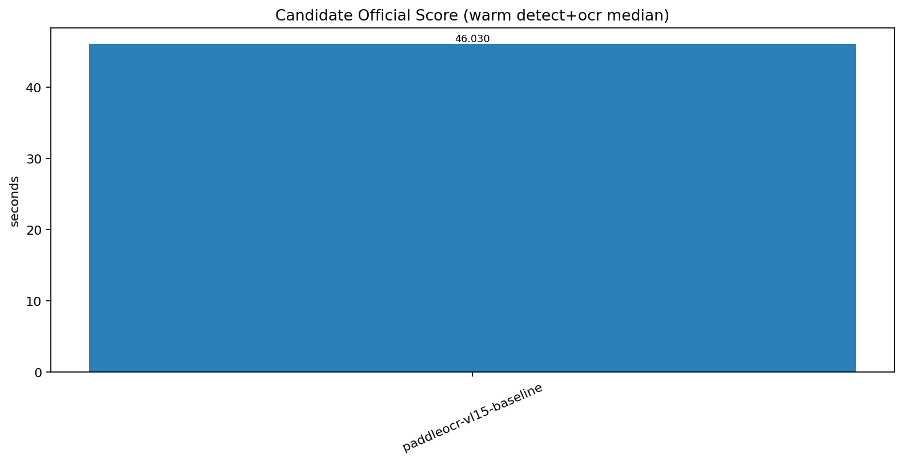
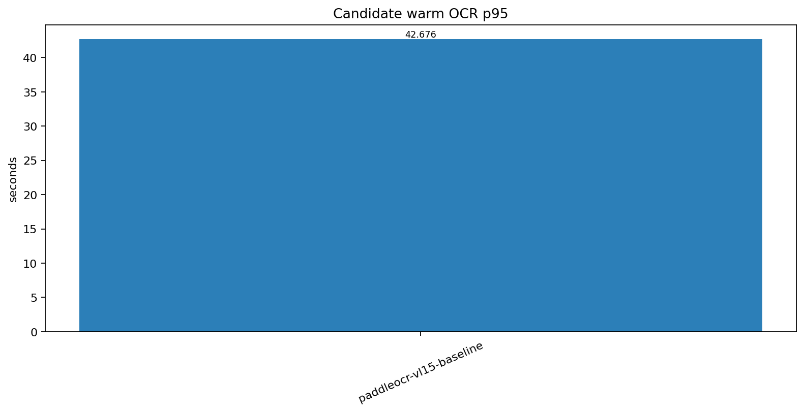
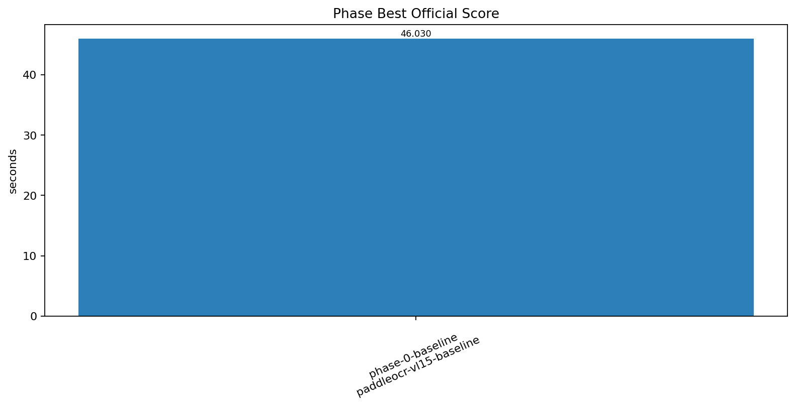

# 자동 벤치마크 보고서 - PaddleOCR-VL-1.5 Runtime Benchmark

이 문서는 `PaddleOCR-VL 1.5` actual-pipeline family suite 결과에서 자동 생성됩니다.

## 보고서 메타데이터

- 생성 시각: `2026-04-07 03:55:08 대한민국 표준시`
- 벤치마킹 이름: `PaddleOCR-VL-1.5 Runtime Benchmark`
- 벤치마킹 종류: `managed family suite`
- 벤치마킹 범위: `actual offscreen app pipeline; official score and quality gate use detect+ocr only`
- baseline SHA: `smoke`
- develop ref SHA: `smoke`
- results root: `./banchmark_result_log/paddleocr_vl15`
- gold path: `./banchmark_result_log/paddleocr_vl15/gold/20260407_034713_paddleocr-vl15-baseline_one-page_r1_baseline_gold.json`

## 라운드 결론

- 최종 winner: `paddleocr-vl15-baseline`
- official detect+ocr median: `46.03`
- develop 승격 가능: `False`
- baseline 대비 개선폭: `0.0%`

## Candidate Phase 순서

## Baseline cold / warm

| run | detect_total_sec | ocr_total_sec | detect_ocr_total_sec | ocr_page_p95_sec | detection_pass | ocr_pass | run_dir |
| --- | --- | --- | --- | --- | --- | --- | --- |
| cold | 3.354 | 42.676 | 46.030 | 42.676 | True | True | ./banchmark_result_log/paddleocr_vl15/20260407_034713_paddleocr-vl15-baseline_one-page_r1 |
| warm1 | 3.354 | 42.676 | 46.030 | 42.676 | True | True | ./banchmark_result_log/paddleocr_vl15/20260407_034713_paddleocr-vl15-baseline_one-page_r1 |

## Candidate 결과

| phase | preset | official_score_detect_ocr_median_sec | warm_ocr_page_p95_median_sec | detection_pass | ocr_pass | promoted | rejection_reason |
| --- | --- | --- | --- | --- | --- | --- | --- |
| phase-0-baseline | paddleocr-vl15-baseline | 46.030 | 42.676 | True | True | True |  |

## Phase Best

| phase | preset | official_score_detect_ocr_median_sec | warm_ocr_page_p95_median_sec | promoted | rejection_reason |
| --- | --- | --- | --- | --- | --- |
| phase-0-baseline | paddleocr-vl15-baseline | 46.030 | 42.676 | True |  |

## 산출물

- candidate CSV: `./docs/assets/benchmarking/paddleocr-vl15/latest/candidates.csv`
- phase-best CSV: `./docs/assets/benchmarking/paddleocr-vl15/latest/phase_best.csv`
- baseline CSV: `./docs/assets/benchmarking/paddleocr-vl15/latest/baseline_runs.csv`
