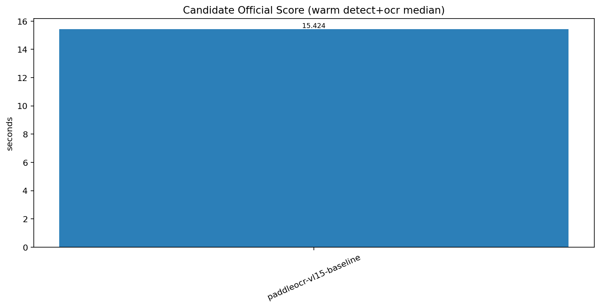
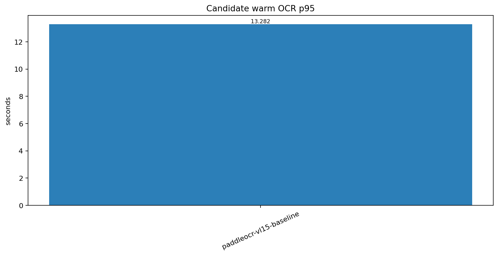
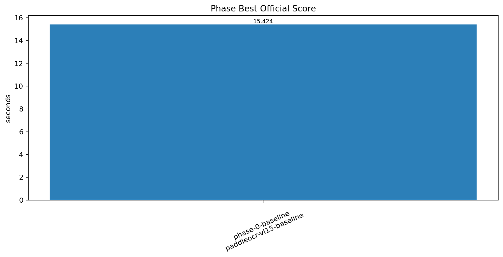

# 자동 벤치마크 보고서 - PaddleOCR-VL-1.5 Runtime Benchmark

이 문서는 `PaddleOCR-VL 1.5` detect+ocr 공식 suite 결과에서 자동 생성됩니다.

## 보고서 메타데이터

- 생성 시각: `2026-04-07 05:20:15 대한민국 표준시`
- 벤치마킹 이름: `PaddleOCR-VL-1.5 Runtime Benchmark`
- 벤치마킹 종류: `managed family suite`
- 벤치마킹 범위: `official default suite uses detect+ocr-only offscreen execution with warm-stable quality gate`
- `execution_scope`: `detect-ocr-only`
- `official_score_scope`: `detect+ocr-only`
- runtime_services: `ocr-only`
- legacy_full_pipeline_available: `True`
- baseline SHA: `smoke`
- develop ref SHA: `smoke`
- results root: `./banchmark_result_log/paddleocr_vl15`
- gold path: `./banchmark_result_log/paddleocr_vl15/gold/20260407_034713_paddleocr-vl15-baseline_one-page_r1_baseline_gold.json`
- stable_page_count: `1`

## 라운드 결론

- 최종 winner: `paddleocr-vl15-baseline`
- official detect+ocr median: `15.424`
- develop 승격 가능: `False`
- baseline 대비 개선폭: `0.0%`

## Official Scope

- `execution_scope`: `detect-ocr-only`
- `official_score_scope`: `detect+ocr-only`
- screen subset: `0006_0005`
- excluded_unstable_pages: `0`

## Candidate Phase 순서

## Warm-Stable Gate

- screen subset: `0006_0005`
- excluded_unstable_pages: `0`

## Baseline cold / warm

| run | detect_total_sec | ocr_total_sec | detect_ocr_total_sec | ocr_page_p95_sec | detection_pass | ocr_pass | run_dir |
| --- | --- | --- | --- | --- | --- | --- | --- |
| cold | 2.142 | 13.282 | 15.424 | 13.282 | True | True | ./banchmark_result_log/paddleocr_vl15/20260407_051724_paddleocr-vl15-baseline_one-page_r1 |
| warm1 | 2.142 | 13.282 | 15.424 | 13.282 | True | True | ./banchmark_result_log/paddleocr_vl15/20260407_051724_paddleocr-vl15-baseline_one-page_r1 |

## Candidate 결과

| phase | stage | preset | official_score_detect_ocr_median_sec | warm_ocr_page_p95_median_sec | detection_pass | ocr_pass | promoted | rejection_reason |
| --- | --- | --- | --- | --- | --- | --- | --- | --- |
| phase-0-baseline | full-confirm | paddleocr-vl15-baseline | 15.424 | 13.282 | True | True | True |  |

## Phase Best

| phase | stage | preset | official_score_detect_ocr_median_sec | warm_ocr_page_p95_median_sec | promoted | rejection_reason |
| --- | --- | --- | --- | --- | --- | --- |
| phase-0-baseline | full-confirm | paddleocr-vl15-baseline | 15.424 | 13.282 | True |  |

## 산출물

- candidate CSV: `./docs/assets/benchmarking/paddleocr-vl15/latest/candidates.csv`
- phase-best CSV: `./docs/assets/benchmarking/paddleocr-vl15/latest/phase_best.csv`
- baseline CSV: `./docs/assets/benchmarking/paddleocr-vl15/latest/baseline_runs.csv`
