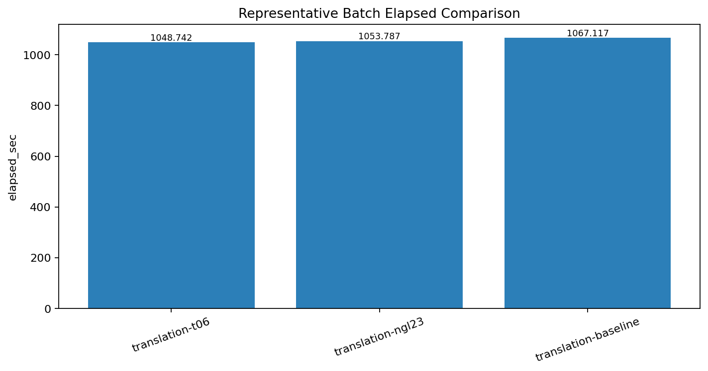
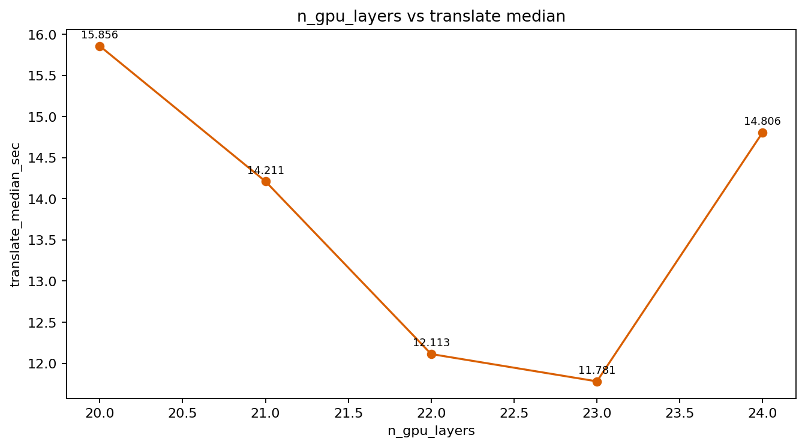
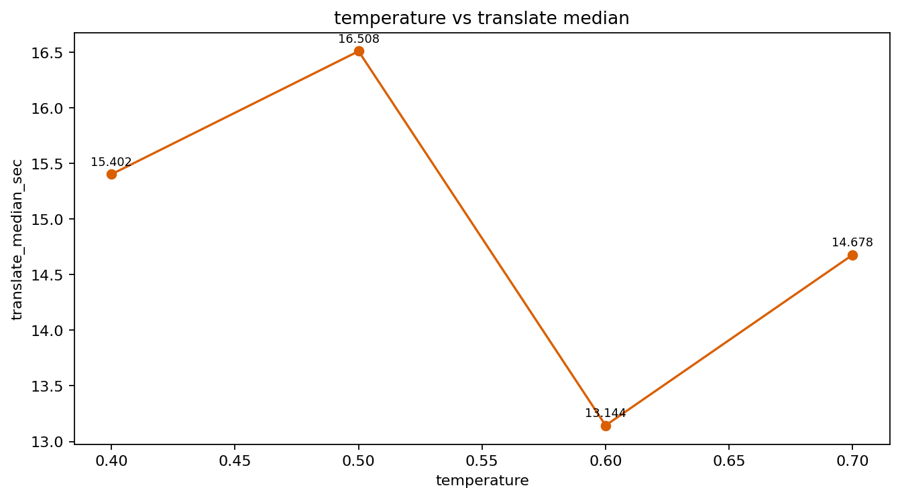
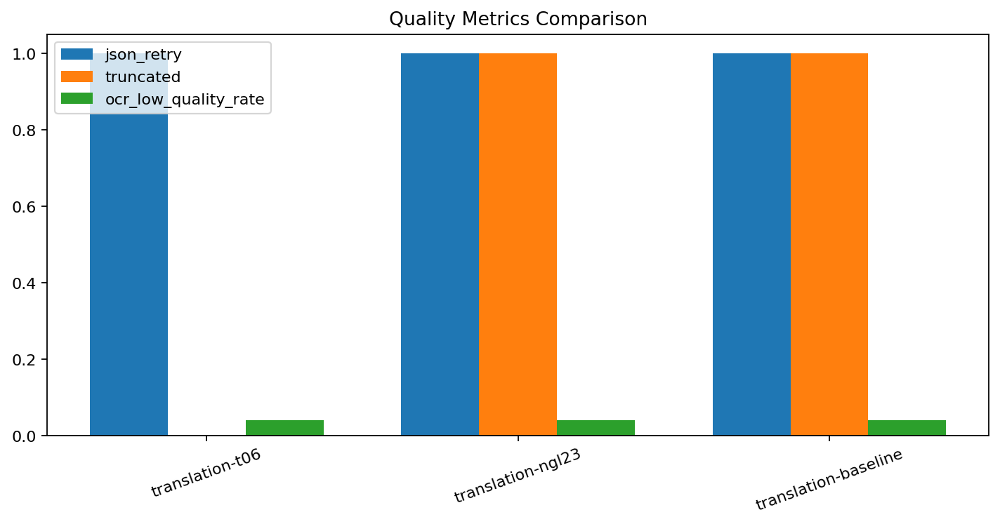

# 자동번역 벤치마크 보고서

이 문서는 `./banchmark_result_log`에 있는 실제 run 결과를 기준으로 자동 생성됩니다.

## 현재 기준 설정

- active preset: `translation-baseline`
- 현재 preset 파일: `./benchmarks/presets/translation-baseline.json`
- results root: `./banchmark_result_log`
- Gemma sampler: `0.6 / 64 / 0.95 / 0.0`
- Gemma runtime: `n_gpu_layers=23`, `threads=12`, `ctx=4096`
- OCR runtime: `front_device=cpu`, `parallel_workers=8`, `max_new_tokens=1024`

## 판단 요약

- translation-t06가 batch elapsed `1048.742s`, translate median `12.150s`, retry `1`, truncated `0`로 가장 균형이 좋았습니다.
- winning candidate run: `./banchmark_result_log/20260406_001330_translation-t06_batch_r1`
- baseline one-page run: `./banchmark_result_log/20260405_224354_translation-baseline_one-page_r1`
- baseline batch run: `./banchmark_result_log/20260405_231837_translation-baseline_batch_r1`

## Representative Batch 비교

| preset | elapsed_sec | translate_median_sec | ocr_median_sec | inpaint_median_sec | gemma_json_retry_count | gemma_truncated_count | ocr_low_quality_rate | run_dir_rel |
| --- | --- | --- | --- | --- | --- | --- | --- | --- |
| translation-t06 | 1048.742 | 12.150 | 16.604 | 2.253 | 1 | 0 | 0.040 | ./banchmark_result_log/20260406_001330_translation-t06_batch_r1 |
| translation-ngl23 | 1053.787 | 12.999 | 16.821 | 2.215 | 1 | 1 | 0.040 | ./banchmark_result_log/20260405_233628_translation-ngl23_batch_r1 |
| translation-baseline | 1067.117 | 13.511 | 16.358 | 2.081 | 1 | 1 | 0.040 | ./banchmark_result_log/20260405_231837_translation-baseline_batch_r1 |

## `n_gpu_layers` Sweep

| preset | n_gpu_layers | elapsed_sec | translate_median_sec | ocr_median_sec | run_dir_rel |
| --- | --- | --- | --- | --- | --- |
| translation-ngl20 | 20 | 44.145 | 15.856 | 20.171 | ./banchmark_result_log/20260405_225129_translation-ngl20_one-page_r1 |
| translation-ngl21 | 21 | 45.113 | 14.211 | 22.989 | ./banchmark_result_log/20260405_225451_translation-ngl21_one-page_r1 |
| translation-ngl22 | 22 | 44.549 | 12.113 | 23.648 | ./banchmark_result_log/20260405_225737_translation-ngl22_one-page_r1 |
| translation-ngl23 | 23 | 42.305 | 11.781 | 22.132 | ./banchmark_result_log/20260405_230023_translation-ngl23_one-page_r1 |
| translation-ngl24 | 24 | 43.485 | 14.806 | 20.976 | ./banchmark_result_log/20260405_230307_translation-ngl24_one-page_r1 |

## `temperature` Sweep

| preset | temperature | elapsed_sec | translate_median_sec | ocr_median_sec | run_dir_rel |
| --- | --- | --- | --- | --- | --- |
| translation-t04 | 0.400 | 46.417 | 15.402 | 21.136 | ./banchmark_result_log/20260406_000110_translation-t04_one-page_r1 |
| translation-t05 | 0.500 | 49.127 | 16.508 | 24.024 | ./banchmark_result_log/20260406_000423_translation-t05_one-page_r1 |
| translation-t06 | 0.600 | 41.801 | 13.144 | 19.472 | ./banchmark_result_log/20260406_000711_translation-t06_one-page_r1 |
| translation-t07 | 0.700 | 42.597 | 14.678 | 19.965 | ./banchmark_result_log/20260406_000955_translation-t07_one-page_r1 |

## 품질 지표 비교

| preset | gemma_json_retry_count | gemma_truncated_count | ocr_empty_rate | ocr_low_quality_rate | audit_passed |
| --- | --- | --- | --- | --- | --- |
| translation-t06 | 1 | 0 | 0.000 | 0.040 | True |
| translation-ngl23 | 1 | 1 | 0.000 | 0.040 | True |
| translation-baseline | 1 | 1 | 0.000 | 0.040 | None |

## 재현 입력

- manifest: `./benchmarks/report_manifest.yaml`
- baseline run dir: `./banchmark_result_log/20260405_231837_translation-baseline_batch_r1`
- winner candidate run dir: `./banchmark_result_log/20260406_001330_translation-t06_batch_r1`

## 참고

- 실제 비즈니스 코드는 stage event와 통계 surface만 노출하고, 실험 비교/차트/판단은 benchmark 레이어에서 처리합니다.
- raw 결과를 남겨두면 이 보고서를 언제든 다시 생성할 수 있습니다.
