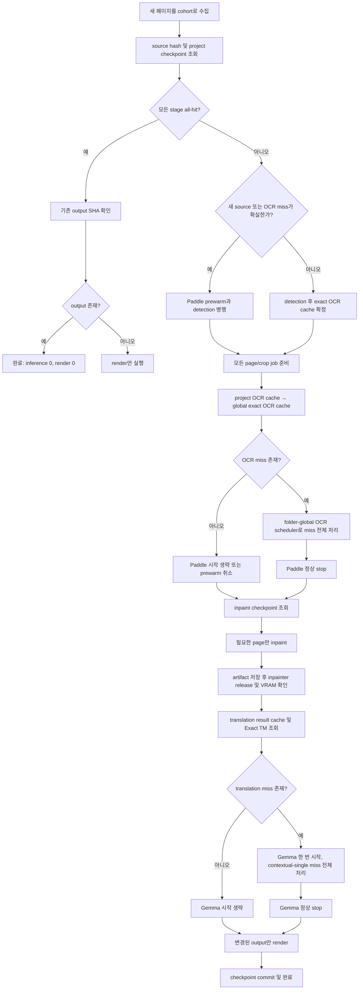

# Comic Translate 전체 실험 감사 및 다음 속도 최적화 계획

- 작성일: 2026-07-30 (Asia/Seoul)
- 기준 저장소: 현재 repository checkout
- 기준 브랜치: `benchmarking/lab` (`95047c7`)
- 제품 브랜치: `main` (`163d064`), `develop` (`1439a41`)
- 출시 버전: `v1.2.0`
- 대상 하드웨어: RTX 4070 SUPER 12GB, Ryzen 7 9800X3D, Windows/WSL2
- 문서 성격: 지금까지 수행한 최적화·품질·캐시·런타임·릴리스 실험의 최종 감사 기록과 다음 실험 계획
- 저장 정책: 원시 OCR·번역·이미지는 Git 밖 검증 폴더에 저장
- 저장소 판본: 로컬 절대경로와 raw-output 링크를 중립 placeholder로 치환한 보존본

---

## 1. 결론

현재 제품은 다음 상태로 확정됐다.

1. 제품 번역 기본값은 계속 `IQ4_NL + contextual-single + chunk 6 + no-spec + F16`이다.
2. `contextual-grouped` 승격 조합은 번역 속도는 40.057% 빨랐지만 의미 품질이 나빠져 퇴역했다.
3. Q8, QAT, ngram speculative decoding, MTP는 현 환경에서 제품 승격 근거를 만들지 못했다.
4. PaddleOCR-VL은 PP-OCRv6보다 느린 경우가 있었지만 실제 일본어 대사 품질이 더 좋아 그대로 유지한다.
5. 반복 작업 속도는 이미 크게 좋아졌다.
   - 번역 result cache all-hit: cold 대비 96.720% 단축
   - 전역 PaddleOCR exact cache all-hit: 99.445% 단축
   - 프로젝트 checkpoint all-hit: 94.115% 단축
   - 프로젝트 `cold + all-hit`: 캐시 없이 두 번 돌리는 것보다 44.261% 빠름
   - 프로젝트 `cold + 한 페이지 수정`: 0.931% 순이득
6. 완전히 새로운 이미지에는 기존 결과 캐시가 거의 hit하지 않는다. 새 이미지 cold-path에서 가장 유망한 미승격 후보는 출력이 같았던 `Paddle folder-global queue`의 2.8904% 개선이다.
7. 새 이미지 속도를 더 올리려면 다음 순서가 가장 합리적이다.
   - 페이지별 OCR executor를 폴더 전역 scheduler 하나로 합치기
   - Paddle completion limit 768 재검증
   - vLLM `max_num_batched_tokens`, `max_num_seqs`, prefix/MM cache를 한 축씩 재검증
   - Gemma `batch=1024`의 의미 품질을 검수한 뒤 재측정
   - 새 페이지가 cache miss임을 미리 알 수 있을 때 Paddle prewarm을 detection과 겹치기
   - 여러 번 들어오는 새 페이지를 짧은 cohort로 묶어 모델 시작 비용을 한 번만 지불하기
8. Gemma 컨테이너만 켜 두고 모델을 RAM/VRAM에서 내리는 것만으로는 빨라지지 않는다. 다만 후속 실측에서 정상 `stop` 뒤 Windows/WSL 파일 페이지 캐시가 남은 재시작은 healthy까지 66.811초에서 16.865초로 74.757% 단축됐다. 모델을 VRAM에 계속 둔 채 full stage-batch를 시작하면 GPU 여유가 79MiB까지 내려갔으므로 기본 정책은 여전히 단계별 단일 GPU 모델 상주다.

속도 승격 정책은 다음으로 고정한다.

> 품질과 구조가 같고 반복 측정으로 실제 이득임이 확인되면 개선 폭이 작아도 채택한다. 임의의 3%, 5%, 10% 최소 문턱은 두지 않는다. 단, 측정 오차·의미 품질·시각 품질·VRAM·swap 안전성은 별도 게이트로 유지한다.

---

## 2. 현재 Git·PR·릴리스 상태

### 2.1 브랜치와 버전

| 항목 | 확인 결과 |
|---|---|
| 작업 트리 | clean |
| 현재 브랜치 | `benchmarking/lab` |
| 장기 로컬 브랜치 | `main`, `develop`, `benchmarking/lab`만 존재 |
| 장기 원격 브랜치 | `origin/main`, `origin/develop`, `origin/benchmarking/lab`만 존재 |
| 애플리케이션 버전 | `1.2.0` |
| 현재 열린 PR | 0 |
| 최신 태그 | `v1.2.0` |

### 2.2 v1.2.0 출시

- GitHub Release: [v1.2.0](https://github.com/robinhood0107/document-translate-myfix/releases/tag/v1.2.0)
- 공개 상태: draft 아님, prerelease 아님
- 공식 자산:
  - `comic-translate-v1.2.0-windows-launcher-source.zip`
  - `SHA256SUMS.txt`
- 로컬 ZIP SHA-256:

```text
b52879bdb652c478ed1bd25c8ba7f4c64fbbd8f275415e5fbfaca1f34f5d6606
```

- 보안 감사: 보고 대상 취약점 0, 선택한 diff 범위 coverage complete
- 제한:
  - 현재 Windows 계정 권한 때문에 symlink 생성 테스트 3개가 skip됨
  - 해당 소스의 symlink/path traversal 방어와 비-symlink 테스트는 별도로 검토됨
  - `.qm`은 바이너리를 역해석하지 않고 `.ts` XML과 재컴파일 일치 검사를 사용함

근거:

- v1.2.0 보안 감사 보고서: `<validation-log-root>/releases/v1.2.0-20260730.LX3zHr/security-diff-report.md`
- v1.2.0 로컬 릴리스 검증 폴더: `<validation-log-root>/releases/v1.2.0-20260730.LX3zHr`

---

## 3. 구현·검증·릴리스 진행 이력

### 3.1 Gemma grouped부터 v1.1.1까지

| PR | 결과 | 핵심 내용 |
|---:|---|---|
| #141 | 병합 | grouped parser, request context, fallback, split, telemetry 기반 구현 |
| #142 | 병합 | Gemma versioned named volume, manifest, runtime fingerprint |
| #143 | 병합 | inpainter 해제 후 Gemma 시작, GPU handoff |
| #144 | 병합 | SQLite translation result cache와 승인형 Exact TM |
| #145 | 병합 | PaddleOCR runtime readiness 보강 |
| #146 | 병합 | 최종 Gemma blind 비교 도구 |
| #147 | 병합 | 최종 stop 판정 보고 |
| #148 | 병합 | 292행 final A/B 도구와 품질 탈락 증거 |
| #149 | 병합 | 제품 `contextual-grouped` 경로 퇴역 |
| #150 | 병합 | lab에 grouped 퇴역 재현 기록 |
| #151 | 병합 | 범용 pipeline performance telemetry |
| #152 | 병합 | PaddleOCR-VL exact persistent result cache |
| #153 | 병합 | project checkpoint foundation |
| #154 | 병합 | detection/OCR checkpoint |
| #155 | 병합 | inpaint/render checkpoint |
| #156 | 병합 | checkpoint telemetry replay 수정 |
| #157 | 병합 | cold/cache finalization benchmark |
| #158 | 병합 | OCR stage 구조 보고 수정 |
| #159 | 병합 | single translation profile benchmark 수정 |
| #160 | 병합 | Gemma batch runtime hook |
| #161 | 병합 | Gemma batch matrix |
| #162 | 병합 | Gemma batch 판정 기록 |
| #163 | 병합 | 나머지 cold 후보 탈락/유지 판정 기록 |
| #164 | 병합 | 공식 launcher-source release 방식 |
| #165 | 병합 | v1.1.0 release audit |
| #166 | 병합 | v1.1.0 main 승격 |
| #167 | 병합 | v1.1.1 보안 dependency hotfix |
| #168 | 병합 | main → develop 동기화 |
| #169 | 병합 | repo policy Unicode/path 보강 |
| #170 | 병합 | benchmarking/lab 동기화 |

### 3.2 QAT·MTP 토너먼트부터 v1.2.0까지

| PR | 결과 | 핵심 내용 |
|---:|---|---|
| #171 | 병합 | 앞으로 AI를 contributor로 표기하지 않는 문서 정책 |
| #172 | 병합 | commit-msg, pre-push, CI에서 AI contributor identity 차단 |
| #173 | 병합 | attribution 정책을 lab에 동기화 |
| #174 | 병합 | llama.cpp 모델·ngram·MTP 토너먼트 runner |
| #175 | 병합 | idle GPU 사전검사 허용치를 2GiB로 조정 |
| #176 | 병합 | swap 압력에서 NGL 탐색 방향 수정 |
| #177 | 병합 | NGL 상한을 실제 모델 layer 수에 맞춤 |
| #178 | 병합 | MTP telemetry와 실패 증거 보존 |
| #179 | 병합 | 안전한 NGL 후보만 비교 |
| #180 | 병합 | 전역 WSL swap과 컨테이너 cgroup swap 구분 |
| #181 | 병합 | NGL 성능·swap의 비단조 특성을 고려한 전수 sweep |
| #182 | 병합 | 12GiB benchmark container에서 swap 비활성화 |
| #183 | 병합 | 순이득 검증을 통과한 project checkpoint 기본 활성화 |
| #184 | 병합 | project checkpoint net-speed benchmark를 lab에 보존 |
| #185 | 병합 | checkpoint 제품 코드를 lab에 동기화 |
| #186 | 병합 | debug 산출물을 `.ctpr.cache`/`.ctcache` 아래로 통일 |
| #187 | 병합 | debug sidecar 구현을 lab에 동기화 |
| #188 | 병합 | v1.2.0 release 준비 |
| #189 | 닫힘 | 직접 `develop → main` 방식, #190으로 대체되어 미병합 |
| #190 | 병합 | 별도 promotion branch로 v1.2.0 main 승격 |
| #191 | 병합 | main → develop back-merge |
| #192 | 병합 | v1.2.0을 benchmarking/lab에 동기화 |

### 3.3 토너먼트 인프라에서 실제로 고친 문제

- 모델과 MTP는 실행 전에 named volume에 준비하고 전체 SHA-256을 검증했다.
- 제품 모델 volume은 건드리지 않았고, 실험 모델은 별도 lab volume을 사용했다.
- runtime mount는 read-only였다.
- 같은 파일명으로 MTP가 덮어써질 수 있던 문제를 발견해 다음처럼 역할별 이름으로 분리했다.

```text
mtp-hauhaucs-gemma-4-26B-A4B-it.gguf
mtp-unsloth-qat-gemma-4-26B-A4B-it.gguf
mtp-unsloth-base-gemma-4-26B-A4B-it.gguf
```

- idle GPU 사용량은 사용자 결정에 따라 2GiB 이하이면 실행하도록 했다.
- NGL은 “높을수록 항상 좋다”는 가정을 버리고 실제 layer 상한 안에서 비단조 sweep을 수행했다.
- 컨테이너 swap은 0으로 고정하고 전역 WSL swap은 별도 진단값으로 기록했다.
- 오래된 `-cd` 대신 현재 llama.cpp MTP 인자를 사용했다.
- GPU draft 호환 실패도 성공 telemetry와 섞지 않고 실패 증거로 남겼다.

### 3.4 자동 검증 이력

아래 수는 각 변경 시점의 테스트 inventory 기준이다. 중간에 테스트가 추가됐으므로 서로 더해서 “총 테스트 수”로 해석하지 않는다.

| 변경 구간 | CUDA12 | CUDA13 | 추가 검증 |
|---|---:|---:|---|
| attribution 정책·초기 hook | 24 통과 | 24 통과 | Python 508파일, headless smoke, 번역 자산, launcher |
| checkpoint 압축/복원 | 82 통과 | 82 통과 | 실제 2014×2885 sample object 29.05MB → 4.32MB |
| idle GPU 2GiB preflight | 24 통과 | 24 통과 | named volume 9파일 inventory 재검증 |
| container swap gate | 34 통과 | 34 통과 | cgroup 미지원/timeout fallback |
| NGL 비단조 탐색 | 36 통과 | 36 통과 | 중간 실패 뒤 상위 NGL 재통과와 하향 안전점 |
| no-swap container | 38 통과 | 38 통과 | `memory.max=12GiB`, `memory.swap.max=0` |
| project checkpoint 핵심 | 50 통과 | 50 통과 | Python 450파일, headless smoke |
| checkpoint 기본 ON migration | 61 통과 | 설정 11 + checkpoint 32 + stage 19 통과 | 사용자가 다시 OFF로 바꾼 선택 보존 |
| checkpoint 제품 브랜치 최종 | 63 통과 | 63 통과 | Python 450파일, headless smoke, 번역 assets |
| debug sidecar 개발 중간 | 679 통과, 6 skip | 695 통과, 6 skip | 로컬 fixture 의존 2건 제거, pytest 우연 의존 16건을 unittest로 전환 |
| v1.2.0 최종 checkout | 700 통과, 6 skip | 700 통과, 6 skip | Python 검사, headless smoke, `.ts/.qm`, CUDA12/13 launcher |

최종 release 감사에서 별도로 확인한 항목:

- checkpoint/debug 보안 집중 테스트 72개 통과, host 권한 symlink 3개 skip
- attribution/repository policy 테스트 18개 통과
- Git diff 기반 보안 findings 0
- source-launcher allowlist, path traversal, secret, manifest SHA, archive membership 검사 통과
- PR template의 Nuitka 항목은 필수가 아니라 선택 사항으로 수정
- Nuitka PowerShell 도구는 비공식 수동 도구로만 유지

---

## 4. 전체 실험 결과 감사

## 4.1 파이프라인 stage-batching

과거 페이지별 파이프라인과 stage-batched 구조의 비교다.

| 후보 | 전체 시간 | 결과 |
|---|---:|---|
| legacy page-by-page | 995.846초 | 과거 기준선 |
| stage-batched single OCR | 714.725초 | 28.2% 단축, 채택 |
| dual resident | 1664.021초 | legacy보다 67.1% 느림, single OCR보다 약 132.8% 느림 |

판정:

- “여러 페이지를 stage 단위로 몰아서 처리해 runtime 시작 비용을 한 번만 지불한다”는 구조는 큰 이득이 있었다.
- Paddle과 Gemma를 GPU에 동시에 상주시킨 dual-resident 방식은 12GB 환경에서 명백히 나빴다.
- 이 값은 과거 13페이지 계열 측정이므로 현재 v1.2.0과 절대시간을 직접 비교하면 안 되지만, 단계별 단일 GPU 상주 정책을 지지하는 역사적 근거다.

근거:

- [workflow split 결과 이력](<../../docs/benchmark/workflow-split-runtime/results-history-ko.md>)
- 원시 suite 요약: `<benchmark-log-root>/workflow-split-runtime/last_workflow_split_runtime_suite.json`

## 4.2 Gemma grouped F16과 Q8

### 속도

| 후보 | 번역 전용 중앙값 | 기준선 대비 |
|---|---:|---:|
| contextual-single 기준선 | 173.665초 | 기준 |
| grouped F16 | 104.100초 | 40.057% 단축 |
| grouped Q8 | 109.025초 | grouped F16보다 4.730% 느림 |

Q8에서는 partial fallback 1블록과 invalid value 1건도 발생했다.

### 292행 blind 품질

| 후보 | 회귀 행 | 회귀 출력 | 두 라운드 반복 회귀 행 |
|---|---:|---:|---:|
| A `current-contextual-single` | 14 | 18 | 4 |
| B `grouped-f16` | 21 | 36 | 15 |

중요한 해석:

- A는 `IQ4_XS + contextual-single + chunk 6 + ngram draft8 + F16`이었다.
- B는 `IQ4_XS + contextual-grouped + chunk 7 + no-spec + F16`이었다.
- 실제 제품은 `IQ4_NL + contextual-single + chunk 6 + no-spec + F16`이다.
- 따라서 grouping 하나만이 모든 품질 차이의 원인이라고 단정할 수는 없다.
- 그러나 승격하려던 B 조합 전체가 절대 품질 게이트를 실패한 것은 명확하다.

판정:

- 제품 grouped 경로는 퇴역했다.
- strict JSON decoder, immutable request context, HTTP 분류, single retry, 논리/HTTP telemetry, 번역 캐시는 grouped와 독립적인 안전장치이므로 유지했다.
- grouped 22페이지 전체 pipeline 검증은 미완료가 아니라 품질 게이트에 따른 정상 취소다.

근거:

- [번역 전용 최종 보고서](<../../docs/benchmark/gemma-final-translation/generated/latest-report-ko.md>)
- 292행 Codex 전수 검수: `<benchmark-log-root>/gemma-final-ab/20260728_final_ab_v4_user_review_ready/codex-review-summary-ko.md`
- unblind 판정: `<benchmark-log-root>/gemma-final-ab/20260728_final_ab_v4_user_review_ready/unblind_summary.md`

## 4.3 IQ4_NL, IQ4_XS, QAT, ngram, MTP 토너먼트

### 실행 범위

- GGUF/MTP inventory: 9개 파일 전체 SHA-256 검증
- 호환성 smoke: 42개 프로필
- sensitive-15: smoke 생존 36개 프로필
- 의미 검수: 36 × 15 = 540개 출력 전수 대조
- sensitive-15 자동 구조 검증:
  - 36/36 프로필 모두 15/15
  - 순서 보존
  - 빈 값 0
  - 구조 오류 0
  - fallback 0
  - `finish_reason=length` 0
  - 컨테이너 swap 0
- 최종 speed screen 진출: 4개 프로필

### speed screen 결과

| 프로필 | 중앙값 | 기준선 대비 | 판정 |
|---|---:|---:|---|
| HauhauCS IQ4_NL no-spec | 28.2047초 | 기준 | 제품 유지 |
| HauhauCS IQ4_XS no-spec | 27.9409초 | 명목상 0.9354% 빠름 | 통계적 우위 불확실 |
| Unsloth IQ4_NL MTP draft4 | 32.4948초 | 12.2985% 느림 | 탈락 |
| Unsloth IQ4_XS MTP draft8 | 40.8504초 | 41.1746% 느림 | 탈락 |

IQ4_XS의 paired 개선 신뢰구간:

- 단측 95% 하한: -3.0498%
- 0을 넘지 못했으므로 “실제로 빠르다”는 증거가 부족하다.

MTP:

- CPU draft에서는 실제 accepted token이 생성됐다.
- 그러나 draft 생성과 target 검증 비용을 포함한 request-only 시간이 더 느렸다.
- 현재 llama.cpp 이미지에서 GPU draft는 `vector::_M_range_check` 호환 오류가 발생했다.
- 따라서 MTP를 제품 경로에 추가하지 않았다.

QAT:

- 선입견 없이 smoke와 sensitive-15에 포함했다.
- 일부 프로필은 구조적으로 성공했지만 고유명사, 주체/대상, 명시적 의미 품질에서 탈락했다.
- 속도·품질을 함께 만족한 QAT 프로필은 없었다.

최종 판정:

- `final54`는 속도 자격을 얻은 후보가 없어 정상 취소했다.
- 제품 기본 모델은 IQ4_NL 그대로다.
- IQ4_XS의 작은 명목 이득은 “놓친 확정 이득”이 아니라 “측정 노이즈와 구분하지 못한 후보”다.

근거:

- sensitive-15 품질 전수 검수: `<validation-log-root>/gemma-llamacpp-profile-tournament/20260729_run_v7/sensitive15-quality-review-ko.md`
- screen-18 최종 속도 판정: `<validation-log-root>/gemma-llamacpp-profile-tournament/20260729_run_v7/screen18-decision-ko.md`
- [토너먼트 제품 문서](<../../docs/benchmark/gemma-llamacpp-profile-tournament/generated/latest-report-ko.md>)

## 4.4 PP-OCRv6 최고 품질 비교

52블록·13페이지 예비 비교:

| 후보 | exact | 빈 결과 | 52블록 시간 |
|---|---:|---:|---:|
| PaddleOCR-VL | 33 | 0 | 46.16초 |
| PP-OCRv6 medium | 19 | 4 | 33.89초 |
| PP-OCRv6 medium + side 960 | 14 | 6 | 403.74초 |

표면적으로 PP-OCRv6 medium은 약 26.6% 빨랐다. 그러나 품질은 제품 승격 기준에 못 미쳤다.

- PaddleOCR-VL의 seed 문자 오류 201개 중 152개는 실제 문자가 없는 한 crop에서 긴 문서를 환각한 단일 outlier였다.
- 그 outlier를 제외하면 PaddleOCR-VL 오류 49, PP-OCRv6 오류 100이었다.
- PP-OCRv6는 비문자 패턴을 빈 값으로 돌려 거대한 환각을 막는 장점이 있었다.
- 반면 실제 일본어 대사 시작·조사·작은 글자 누락, ruby 중복, 문자 치환, 배경 그래픽 혼입이 많았다.
- side 960 고해상도 설정은 품질을 회복하지 못하고 403.74초로 크게 느려졌다.

판정:

- 사용자가 정한 “PaddleOCR-VL보다 전반적으로 좋아지는 경우에만 채택” 게이트를 실패했다.
- PaddleOCR-VL-1.6-0.9B + vLLM을 제품 OCR로 유지한다.

근거:

- PP-OCRv6 품질 판정: `<benchmark-log-root>/ppocrv6_quality/20260727_ppocrv6_quality_52/decision-ko.md`

## 4.5 Paddle derived image

| 시나리오 | 기존 | derived | 개선 |
|---|---:|---:|---:|
| 컨테이너 recreate 후 OCR ready | 87.276초 | 60.885초 | 26.391초 |
| 정상 stop/start 반복 | 45.131초 | 44.030초 | 1.101초 |

판정:

- image 재생성·설치 경로에는 의미 있는 효과가 있었다.
- 평상시 반복 실행에는 1.101초만 줄어 기존 30초 게이트를 실패했다.
- 새 페이지 한 번 처리의 OCR 추론 자체를 빠르게 하지 않는다.
- custom derived image를 제품 기본으로 넣지 않았다.

근거:

- derived image 결과: `<benchmark-log-root>/paddle-derived-image/20260727T151206Z/summary.json`

## 4.6 Paddle folder queue

3페이지, 60 OCR 요청, 3라운드:

| 후보 | 중앙값 | exact |
|---|---:|---|
| page barrier, workers 8 | 46.2844초 | True |
| folder queue, workers 4 | 44.9466초 | True |

- 개선: 2.8904%
- 모든 라운드 출력 exact
- 당시 “OCR 10% 이상” 게이트 때문에 탈락

새 정책에서의 재판정:

- 최소 개선율을 두지 않으므로 다시 볼 가치가 가장 큰 cold-path 후보다.
- 다만 표본이 3페이지이므로 바로 제품 승격하지 않고 6페이지 × 3회, 그 뒤 필요 시 22페이지로 확장해야 한다.
- 품질은 현재 표본에서 완전히 같았다.

근거:

- folder queue suite: `<benchmark-log-root>/paddleocr_folder_queue/20260728_082331_paddleocr-folder-queue-small-screen/suite_summary.md`

## 4.7 GPU handoff와 overlap

4페이지 offscreen 비교:

- 인페인트 시작과 동시에 Gemma 시작: 안전 기준선보다 느리고 inpaint p95 악화
- 인페인트 75%에서 Gemma 시작: 약 5% 빨랐음
- 그러나 GPU 여유가 절반 이하로 감소
- shared GPU memory와 WSL swap 압력이 반복 증가

판정:

- 75% overlap은 숫자만 보면 작은 이득이 맞다.
- 그러나 12GB에서 OOM·shared memory·swap 위험을 늘리므로 제품 후보가 아니다.
- 모든 inpaint 결과·mask·patch·debug 자료를 확정한 뒤 inpainter만 해제하고 VRAM 반환을 확인한 후 Gemma를 시작한다.

근거:

- [GPU handoff truth specification](<../../docs/performance-and-bugfix-audits/auto-translation-performance/00-truth-specification-ko.md>)

## 4.8 cold-path 후보 matrix

현재 제품 기준선:

- Gemma: IQ4_NL, contextual-single, chunk 6, no-spec, F16
- Paddle client workers: 8
- Paddle `max_num_seqs`: 32
- Paddle `max_num_batched_tokens`: 98,304
- Paddle completion limit: 1024
- vLLM prefix caching: ON
- multimodal processor cache: default
- detector: 단건 ONNX

| 축 | 가장 나은 관측값 | 품질·안전 상태 | 현재 판정 |
|---|---:|---|---|
| Gemma HTTP Session | 4.632% 느림 | 출력 동일 | 현행 요청 방식 유지 |
| Paddle thread-local Session | 3.653% 느림 | 출력 동일 | 현행 유지 |
| Paddle workers 6 | 0.026% 개선 | exact, 사실상 노이즈 | workers 8 유지 |
| `max_num_seqs=48` | 약 0.585% 개선 | exact, wall variance | 재검증 후보 |
| `max_num_batched_tokens=49,152` | 0.970% 개선 | exact | 재검증 후보 |
| Paddle tokens 768 | 4.178% 개선 | 표본 exact | 최우선 재검증 후보 |
| Paddle tokens 512 | 7.760% 개선 | raw OCR 변경 | 탈락 |
| Paddle tokens 256 | 12.372% 개선 | raw OCR 변경 | 탈락 |
| prefix OFF/MM default | 0.865% 개선 | exact, 작은 표본 | 재검증 후보 |
| prefix OFF/MM 0 | 0.527% 개선 | variance | 낮은 우선순위 |
| prefix ON/MM 0 | 0.595% 느림 | exact | 탈락 |
| IQ4_XS | 이전 3.742%, 최종 0.935% 명목 개선 | 통계적 우위 불명 | IQ4_NL 유지 |
| chunk 12 | 1.357% 개선 | 구조 통과, variance 5.135%, 의미 미검수 | 미승격 |
| chunk 9 | 0.731% 개선 | 구조 안정, 의미 미검수 | 재검증 가능 |
| Gemma `np=2` | 29.922% 느림 | 구조 통과 | 탈락 |
| Gemma batch 1024 | 4.871% 개선 | 54/54 구조, variance 0.609%, 의미 미검수 | 최우선 재검증 후보 |
| Gemma batch 4096 | 3.057% 개선 | 구조 통과 | batch1024보다 후순위 |
| detector batch 2 | 1.807% 개선 | 1/6페이지 boxes 변경 | 품질 게이트 탈락 |
| detector batch 4 | 5.047% 느림 | 2/6페이지 변경 | 탈락 |
| inpaint channels-last | 2.232% 개선 | SSIM 0.999744, max diff 15 | exact 정책에서 탈락 |
| inpaint fixed-shape compile | 19.539% 개선 | 고정 shape exact, 가변 384→512 실패 | 연구 후보 |
| inpaint microbatch 2 | 40.157% 개선 | SSIM 0.999596, 순차 overlap 의미 변경 | 탈락 |
| inpaint microbatch 4 | 44.051% 개선 | SSIM 0.999565, 순차 overlap 의미 변경 | 탈락 |

측정했지만 더 진행하지 않은 축:

- page load, decoded hash, crop encode 중복: OCR 시간의 약 0.25%
- JPEG encode/base64: OCR 시간의 약 0.05%
- Paddle wrapper overhead: OCR의 10% 미만
- direct vLLM endpoint: 전체 Paddle pipeline과 동일한 계약이 아니며 예상 이득이 작아 중단

근거:

- cold-path 최종 판정: `<validation-log-root>/cold-cache-finalization/20260729_cold_path_final_decision_v1/decision-ko.md`
- Gemma batch 보고서: `<validation-log-root>/cold-cache-finalization/20260729_gemma_batch_iq4nl_54_final_v1/report.md`
- Paddle token 보고서: `<validation-log-root>/cold-cache-finalization/20260729_paddle_token_sample1_final_v1/report.md`
- Paddle batched-token 보고서: `<validation-log-root>/cold-cache-finalization/20260729_paddle_batched_tokens_sample1_final_v1/report.md`
- vLLM cache 보고서: `<validation-log-root>/cold-cache-finalization/20260729_vllm_cache_sample1_final_v1/report.md`

---

## 5. 캐시 결과와 새 이미지에서의 한계

## 5.1 번역 result cache와 Exact TM

54블록 실제 Gemma 제품 경로:

| 경로 | 시간 | cold 대비 |
|---|---:|---:|
| cold | 60.301초 | 기준 |
| result cache all-hit | 1.978초 | 96.720% 단축 |
| warm all-hit | 2.019초 | 94.170% 단축 |

추가 검증:

- 54/54 복원
- all-hit Gemma startup 0
- all-hit Gemma HTTP 0
- 27 hit / 27 miss에서도 전체 원문 문맥 유지
- DB lock·손상 시 cache만 끄고 정상 번역으로 fail-open
- 결과 사전은 hit/miss 양쪽에 정확히 한 번 적용

이 캐시는 같은 원문·문맥·모델·prompt·sampler·runtime identity를 다시 번역할 때 강하다. 완전히 새로운 대사는 miss다.

근거:

- [translation-memory fast-path 보고서](<../../docs/benchmark/translation-memory-fast-path/generated/latest-report-ko.md>)

## 5.2 전역 PaddleOCR exact result cache

| 경로 | 중앙값 | 결과 |
|---|---:|---|
| enabled-empty | 19.763초 | miss overhead -0.554% |
| all-hit | 0.110초 | 99.445% 단축 |

all-hit:

- raw OCR exact
- Paddle runtime 시작 0
- 논리 OCR 요청 0
- OCR HTTP 0

하지만 key가 raw crop pixels, 실제 JPEG bytes, 모델/image/command/runtime/preprocess/language/parser identity를 포함하므로 완전히 새로운 crop은 miss다. 좌표가 비슷하다는 이유로 재사용하지 않는다.

근거:

- [cold/cache 결과 이력](<../../docs/benchmark/cold-cache-finalization/results-history-ko.md>)

## 5.3 프로젝트 stage checkpoint

2페이지 실제 offscreen pipeline 최종 v5:

| 시나리오 | 시간 | 판정 |
|---|---:|---|
| cache disabled cold | 139.961초 | 기준 |
| cache enabled empty cold | 147.790초 | 첫 miss overhead 5.594% |
| all-hit | 8.236초 | cold 대비 94.115% 단축 |
| cache 없이 두 번 | 279.923초 | 비교 기준 |
| cold + all-hit | 156.027초 | 44.261% 순이득 |
| cold + 한 페이지 수정 | 277.315초 | 0.931% 순이득 |

통과한 계약:

- all-hit detector inference 0
- all-hit Paddle runtime/HTTP 0
- all-hit Gemma runtime/HTTP 0
- all-hit inpainter inference 0
- output 파일이 없으면 render만 실행
- 한 페이지 수정 시 그 페이지의 변경 stage와 downstream만 재계산
- cached render output exact
- cache 손상·누락 시 정상 계산으로 fail-open

이 결과 때문에 checkpoint는 one-time migration으로 기본 ON이 됐다. 이후 사용자가 OFF로 바꾸면 다시 강제하지 않는다.

근거:

- project checkpoint net-speed v5: `<validation-log-root>/project-checkpoint-net-speed/20260730_project_cache_net_gain_2page_v5/report.md`

## 5.4 완전히 새로운 페이지에서는 무엇이 작동하는가

완전히 새로운 페이지에서는 다음처럼 된다.

| 기능 | 새 페이지에서 기대 |
|---|---|
| project detection checkpoint | miss |
| project OCR checkpoint | miss |
| global OCR exact cache | 동일 crop bytes가 우연히 재등장하지 않으면 miss |
| translation result cache | 동일 원문+전체 문맥 identity가 아니면 miss |
| Exact TM | 사용자가 승인한 동일 원문이면 hit 가능 |
| vLLM prefix/MM processor cache | 동일 token/image hash prefix만 부분 도움 |
| stage-batching | 새 페이지에도 항상 도움 |
| 폴더 전역 OCR queue | 새 페이지 cold OCR에 직접 도움 |

따라서 “all-hit 94.115%”는 같은 프로젝트를 다시 열거나 일부만 고치는 흐름의 결과다. 처음 보는 새 만화 폴더의 OCR·번역 추론을 94% 줄인다는 뜻이 아니다.

## 5.5 캐시 수명관리 현황

### 이미 있는 관리

- 전역 OCR cache:
  - SQLite WAL
  - 기본 50,000 crop
  - LRU 방식 정리
  - hit/miss/item count
  - JSONL export
  - clear
  - lock·손상·schema mismatch fail-open
- translation cache/Exact TM:
  - result retention
  - candidate retention
  - export
  - clear
  - 승인된 Exact TM과 자동 result cache 분리
- project sidecar:
  - content-addressed SHA-256 objects
  - `Clean Unused Cache`
  - `Force Stage Recalculation`
  - `Open Cache Folder`
  - 참조되지 않은 object만 정리
  - 손상 object/DB는 조용히 덮어쓰지 않고 fail-open
- debug sidecar:
  - cache 사용 여부와 별개
  - 개별 debug 토글 유지
  - raw response와 hardware 진단 기본 OFF
  - 일반 cache cleanup이 debug run을 자동 삭제하지 않음

### 아직 부족한 관리

project sidecar 전체에 다음이 없다.

- 프로젝트별 최대 bytes
- 전체 프로젝트 cache 총량 dashboard
- 오래된 debug run 보존 기간/개수
- 마지막 접근 시간과 큰 cache 경고
- 여러 cache를 한 화면에서 보는 통합 관리

### 권장 수명 정책

정확한 content hash 캐시는 TTL로 자동 삭제할 필요가 없다. “오래됐다”는 이유만으로 결과가 틀려지는 것이 아니라 identity가 바뀌면 자동 miss가 되기 때문이다.

권장:

1. 전역 OCR/번역 cache는 item count + byte quota 기반 LRU를 사용한다.
2. project checkpoint가 참조하는 immutable object는 자동 TTL 삭제하지 않는다.
3. 참조가 끊긴 object만 `Clean Unused Cache`로 안전하게 제거한다.
4. debug run은 민감 정보일 수 있으므로 자동 삭제 기본 OFF를 유지한다.
5. 사용자가 선택할 수 있는 debug 보존 정책만 추가한다.
   - 수동만
   - 최근 N회
   - N일
   - 최대 N GiB
6. 통합 “저장 공간” 화면에 다음을 표시한다.
   - global OCR item/bytes
   - translation result/Exact TM item/bytes
   - 현재 project sidecar bytes
   - debug bytes
   - last access
   - clear/export/open
7. quota를 넘겼을 때도 현재 프로젝트가 참조 중인 checkpoint object를 지우지 않는다.

---

## 6. 실제 품질 차이와 예시

## 6.1 grouped 번역

| 행 | 원문 의미 | grouped 회귀 |
|---:|---|---|
| 9 | `だけ`: “오직 ~만” 제한 의미 | 제한 의미 누락 |
| 17 | 생방송의 `生` | live 의미 누락 |
| 62 | “제노비아, 침대에서 자라” | 이름과 침대를 한 단어처럼 결합 |
| 65 | 두 인물이 서로 절정에 이르게 함 | “달구기/한판 뜨기”로 행동 의미 변경 |
| 66, 79 | 긍정 대답 `はい` | 신음으로 변경 |
| 162 | 심리적 느낌 | 육체적 쾌감으로 변경 |
| 184 | 절정한 얼굴 | 일반 표정/숨소리로 약화 |
| 215 | 남자친구 관계 | 다른 관계처럼 변형 |
| 245 | 누가 누구에게 배우는지 | 화자와 행동 방향 반전 |
| 291 | 안쪽으로 쏟아져 들어오는 수동 사건 | 명령 또는 능동 행위로 변경 |

이 차이는 어순이나 말투 취향이 아니라 관계·행동·대상·수동/능동·명시적 의미가 달라진 것이다. 21개 회귀 행 중 15개가 두 라운드에 반복돼 단순 샘플링 우연으로 보기 어려웠다.

## 6.2 QAT·MTP·ngram

sensitive-15에서 탈락시킨 대표 유형:

| 유형 | 예시 |
|---|---|
| 명시적 의미 약화 | `絶頂`을 절정이 아닌 일반 “쾌감” 수준으로 약화 |
| 고유명사 누락 | `林太太`에서 `林`을 빼고 일반 “사모님”으로 번역 |
| 관계 변경 | `林太太`를 “이모님”으로 바꿔 이름과 관계를 동시에 변경 |
| 주체/대상 반전 | 누가 감싸거나 삽입하거나 즐기는지 반대로 번역 |
| 의미 추가 | 원문에 없는 “어머니가 더 중요하다” 같은 비교 의미 추가 |
| 성적 의미 순화 | 명시적 동사를 일반 “해줘”로 완화 |
| 사건 변경 | “붙잡혔다”를 일반적인 실수로 변경 |

MTP가 token acceptance를 만들었다고 해도 최종 의미 품질이나 총시간이 나빠지면 채택할 수 없다.

## 6.3 PP-OCRv6

PP-OCRv6가 좋아진 경우:

- 실제 문자가 없는 패턴 crop을 빈 값으로 처리해 PaddleOCR-VL의 긴 환각을 막음
- 인접 패널 문자나 괄호·ID·일부 기호를 덜 끌어옴

PP-OCRv6가 나빠진 경우:

- `ラブドール愛玩人形を注文したら`에서 앞부분과 조사를 크게 누락
- 읽을 수 있는 작은 대사를 빈 값으로 반환
- `フッ…`을 `7…`로 치환
- 반복 감탄 문자를 다른 기호로 오인
- ruby를 본문과 중복
- 실제 대사의 첫머리나 조사를 빠뜨림

즉 PP-OCRv6는 “비문자 거부”에는 장점이 있었지만 실제 대사 회수율과 문자 정확도가 더 나빴다.

## 6.4 detector·inpaint

- detector batch2는 6페이지 중 1페이지의 boxes가 달라졌다.
- detector batch4는 6페이지 중 2페이지가 달라지고 속도도 느려졌다.
- channels-last는 2.232% 빨랐지만 pixel exact가 아니었고 max difference가 15였다.
- inpaint microbatch는 40% 이상 빨랐지만 순차적으로 겹치는 블록의 결과 의미가 바뀌고 SSIM도 exact가 아니었다.
- fixed-shape `torch.compile`/CUDA graph는 고정 shape에서 19.539% 빨랐고 exact였지만 실제 가변 crop에서 shape 변경 시 실패했다.

따라서 detector/inpaint에서는 “눈으로 비슷해 보임”보다 boxes/mask/pixel 결과가 같아야 한다는 현재 정책이 맞다.

---

## 7. 속도가 조금이라도 좋아졌던 것은 무엇인가

## 7.1 이미 제품에 들어간 확정 이득

| 개선 | 효과 | 상태 |
|---|---:|---|
| stage-batched single OCR | 역사적 기준 28.2% 단축 | 채택 |
| translation result cache | all-hit 96.720% 단축 | 채택 |
| global OCR exact cache | all-hit 99.445% 단축 | 채택 |
| project checkpoint | all-hit 94.115% 단축 | 채택 |
| project cold + all-hit | 반복 총시간 44.261% 순이득 | 채택 |
| project cold + 1페이지 수정 | 반복 총시간 0.931% 순이득 | 채택 |
| Gemma named volume/runtime fingerprint | 매번 host 파일 검사·복사·pull을 피하고 안전 재사용 | 채택 |
| inpainter 완전 해제 후 Gemma | OOM/swap 위험을 막는 안정성 개선 | 채택 |

## 7.2 품질은 같았지만 표본이 작아 다시 볼 후보

| 후보 | 관측 이득 | 현재 품질 근거 | 다음 행동 |
|---|---:|---|---|
| folder-global OCR queue w4 | 2.8904% | 3페이지/60요청/3회 exact | 최우선 6페이지 × 3회 |
| Paddle completion 768 | 4.178% | 작은 표본 raw OCR exact | 긴 출력 포함 54블록/6페이지 |
| `max_num_batched_tokens=49,152` | 0.970% | 작은 표본 exact | 단독 AB/BA |
| prefix OFF/MM default | 0.865% | 작은 표본 exact | 새 crop 중심 AB/BA |
| `max_num_seqs=48` | 0.585% | exact이나 variance | 3회 paired 재검증 |
| workers 6 | 0.026% | exact | 사실상 노이즈, 마지막 순위 |

## 7.3 구조는 같지만 의미 품질을 아직 확인하지 않은 후보

| 후보 | 관측 이득 | 부족한 검증 |
|---|---:|---|
| Gemma batch 1024 | 4.871% | 54/54 구조 통과, 54블록 의미 전수 검수 미완료 |
| Gemma chunk 12 | 1.357% | variance 큼, 의미 품질 미검수 |
| Gemma chunk 9 | 0.731% | 구조 안정, 의미 품질 미검수 |

이 후보는 “품질이 같다”고 아직 말할 수 없다. 기존 raw 결과가 남아 있으면 먼저 Codex가 전수 의미 검수하고, 통과한 축만 다시 AB/BA 측정한다.

## 7.4 숫자는 빨랐지만 채택하면 안 되는 후보

| 후보 | 숫자 | 탈락 사유 |
|---|---:|---|
| grouped F16 | 40.057% | 292행 의미 회귀 |
| PP-OCRv6 medium | 약 26.6% | 일본어 대사 누락·오인식 |
| GPU 75% overlap | 약 5% | shared GPU/WSL swap/VRAM 위험 |
| detector batch2 | 1.807% | boxes 변경 |
| channels-last | 2.232% | pixel 결과 변경 |
| inpaint microbatch | 40~44% | 시각 결과와 순차 의미 변경 |
| fixed-shape compile | 19.539% | 가변 shape 실제 경로 실패 |

## 7.5 “빠르다고 증명되지 않은” 후보

| 후보 | 관측값 | 해석 |
|---|---:|---|
| IQ4_XS | 명목 0.935% | 95% 하한 -3.0498%, 동률 |
| workers 6 | 0.026% | 측정 노이즈 수준 |
| 일부 vLLM cache/sequence 후보 | 0.5~1% | 작은 표본·variance |

이들은 품질 탈락과 다르다. 단지 현재 증거로 속도 우위를 확정하지 못했다.

---

## 8. Gemma 서버와 RAM/VRAM을 어떻게 상주시킬 것인가

## 8.1 세 가지 상태를 구분해야 한다

### A. 컨테이너만 살아 있고 모델은 unload

- Docker container/process 생성과 아주 작은 control-plane 비용은 아낄 수 있다.
- GGUF load, tensor 초기화, GPU offload, KV 준비는 다음 요청 때 다시 한다.
- 큰 시작 시간은 거의 그대로 남는다.
- llama.cpp의 `--sleep-idle-seconds`는 모델과 관련 memory/KV를 RAM에서 내리고 새 task 때 다시 load한다. 이는 메모리 절약 기능이지 다음 cold 요청 가속 기능이 아니다.

판정: 전체 파이프라인 속도 개선책으로는 효과가 작다.

### B. GGUF가 CPU RAM/page cache에 남아 있음

- 파일 read는 빨라질 수 있다.
- Windows/WSL OS page cache가 이미 일부를 자동으로 수행한다.
- named volume은 `/mnt/c` bind 파일보다 안정적인 Linux-side 접근과 immutable identity를 제공한다.
- 그래도 모델 graph 초기화와 GPU layer upload는 다시 필요하다.
- IQ4_NL 파일만 약 14.6GB이므로 별도 “CPU 상주 복제”는 32GB 시스템 RAM에 부담이 크다.
- 2026-07-30 직접 실측에서 오래 멈춘 cold 시작은 66.811초, 정상 `stop` 직후 즉시 재시작은 16.865초였다. OS 페이지 캐시가 남은 경우 healthy까지 74.757% 단축됐다.
- 같은 페이지 캐시 상태로 현재 stage-batched 1페이지를 실행했을 때 OCR·인페인트 뒤 Gemma start/wait는 18.832초였다. cold 시작보다 47.979초, 71.813% 짧았다.

판정: OS page cache와 named volume의 자동 재사용은 실제 이득이 크므로 보존한다. 다만 별도 15GB 익명 메모리 복제나 강제 pin은 기본 기능으로 만들지 않는다. 페이지 캐시는 필요할 때 OS가 회수할 수 있어야 한다.

### C. 모델이 실제로 VRAM에 load된 상태

- 다음 번 translation 시작은 가장 빠르다.
- 하지만 12GB GPU를 Gemma가 차지하면 PaddleOCR-VL이나 inpainter를 동시에 안전하게 쓰기 어렵다.
- 실제 dual-resident는 1664.021초로 크게 느렸고, 75% overlap도 shared memory/swap 압력을 만들었다.

판정: 전체 자동 파이프라인 기본값으로 금지한다.

## 8.2 권장 상주 정책

### 전체 자동 번역

1. PaddleOCR-VL만 load
2. 모든 OCR miss 처리
3. Paddle runtime 정상 `stop`
4. inpainter load
5. 모든 inpaint artifact 저장
6. inpainter release와 VRAM 반환 확인
7. translation cache 조회
8. miss가 있을 때만 Gemma 한 번 load
9. 전체 translation miss 처리
10. Gemma 정상 `stop`
11. render

이 방식이 현재 12GB 환경에서 가장 안전하다.

### OCR만 계속 하는 작업

- 사용자가 계속 새 이미지를 넣는 OCR 전용 모드라면 Paddle hot window를 둘 수 있다.
- 예: 마지막 OCR 후 2~5분 동안 runtime 유지, 새 crop이 들어오면 timer 연장.
- 이 모드에서는 inpainter/Gemma 시작이 요청되면 즉시 Paddle을 stop한다.

### 번역만 계속 하는 작업

- OCR/inpaint가 끝난 여러 프로젝트의 번역만 연속 수행할 때는 Gemma hot window가 가능하다.
- 모델을 unload하지 않고 짧은 idle window 동안 유지한다.
- 새 Paddle/inpaint 작업이 들어오면 우선순위에 따라 stop한다.

### 피해야 할 정책

- full-auto 중 Paddle와 Gemma 동시 VRAM 상주
- inpainter와 Gemma overlap 기본 활성화
- CPU RAM에 모든 모델을 동시에 강제 pin
- `sleep-idle`을 “빠른 재시작”으로 오해

근거:

- [llama.cpp server 공식 문서](https://github.com/ggml-org/llama.cpp/blob/master/tools/server/README.md)
- [현재 Gemma Compose](<../../docker-compose.yaml>)

---

## 9. 현재 파이프라인에서 발견한 새 cold-path 기회

## 9.1 페이지별 OCR executor가 아직 남아 있음

현재 PaddleOCR-VL client는 페이지마다 `ThreadPoolExecutor`를 만든다. stage processor도 페이지 순서로 OCR 호출을 반복한다.

영향:

- executor 생성·종료 반복
- 한 페이지 barrier 때문에 다음 페이지 crop이 GPU queue에 빨리 들어가지 못함
- vLLM continuous batching에 제공할 수 있는 전역 in-flight 폭이 줄어듦

이미 3페이지 실험에서 folder-global queue w4가 exact로 2.8904% 빨랐다.

개선 설계:

- 폴더당 Paddle engine 하나
- global executor 하나
- job에 page index, block index, crop, 고정 result slot
- 전역 in-flight만 concurrency limit
- 결과는 page/block 원순서로 복원
- 일반 페이지 오류는 해당 페이지만 실패
- 사용자 취소/서비스 장애만 대기 job 전체 취소
- page profile을 공유 mutable field가 아니라 페이지별 결과로 반환

공식 PaddleOCR-VL도 directory/list 입력과 queue 사용이 대량 문서에서 더 효율적이라고 안내한다.

근거:

- [현재 페이지별 executor](<../../modules/ocr/ocr_paddle_VL.py>)
- [현재 stage OCR loop](<../../pipeline/stage_batched_processor.py>)
- [PaddleOCR-VL 공식 문서](https://www.paddleocr.ai/latest/en/version3.x/pipeline_usage/PaddleOCR-VL.html)

## 9.2 cache DB가 비어 있지 않다는 이유만으로 prewarm을 미루는 문제

현재 prewarm은 global OCR cache의 `item_count > 0`이면 runtime 시작을 미룬다. 실제로는 DB에 예전 항목이 있어도 이번 새 페이지가 전부 miss일 수 있다.

결과:

- all-hit에서 runtime 시작 0을 지키는 장점은 있다.
- 그러나 완전히 새로운 폴더에서도 detection 동안 Paddle 시작을 겹치지 못할 수 있다.

개선:

1. source decoded hash와 project checkpoint index를 먼저 본다.
2. 모든 페이지가 detection/OCR checkpoint hit 가능성이 있을 때만 prewarm을 미룬다.
3. 새 source hash가 하나라도 있거나 project detection record가 없으면 Paddle을 detection과 동시에 시작한다.
4. detection 후 global exact crop cache가 전부 hit하면 시작 중이던 prewarm을 안전하게 취소/stop한다.
5. 늦은 future가 취소 뒤 runtime을 다시 시작하지 못하도록 generation token으로 동기화한다.

이 항목은 현재 코드에서 도출한 새 후보이며 아직 속도 측정값은 없다.

## 9.3 Paddle token limit 768

- 1024 → 768에서 작은 표본 raw OCR exact와 4.178% 개선이 관측됐다.
- 512/256은 더 빨랐지만 raw OCR가 바뀌어 탈락했다.

빠른 검증:

- 일본어·중국어·영어
- 세로 긴 대사
- ruby
- 기호 반복
- 최대 길이 crop
- 54블록 또는 최대 6페이지
- 순서 변경 3회
- raw OCR, diagnostics, finish reason, token count 완전 동일

통과하면 새 페이지 OCR cold-path에 직접 이득이 있다.

## 9.4 vLLM scheduler 조합

한 축씩:

1. `max_num_batched_tokens`: 98,304 vs 49,152
2. 우승값 고정 후 `max_num_seqs`: 32 vs 48
3. 우승값 고정 후 prefix cache ON/OFF
4. MM processor cache default/0

주의:

- 작은 crop이 대부분 서로 다른 image hash이므로 prefix cache hit가 많지 않을 수 있다.
- vLLM multimodal processor cache도 동일 입력 반복에 주로 유리하다.
- exact persistent OCR result cache를 대신하지 못한다.
- chunked prefill과 batch token 설정은 TTFT와 throughput의 trade-off이므로 wall time, queue wait, VRAM, raw OCR을 함께 봐야 한다.

공식 근거:

- [vLLM optimization](https://docs.vllm.ai/en/v0.10.2/configuration/optimization.html)
- [vLLM automatic prefix caching](https://docs.vllm.ai/en/v0.10.2/features/automatic_prefix_caching.html)
- [vLLM multimodal/prefix 설계](https://docs.vllm.ai/en/v0.10.2/design/prefix_caching.html)

## 9.5 Gemma batch/ubatch와 prompt reuse

가장 유망한 미완료 후보:

- `batch=1024`: 4.871% 개선
- 구조 54/54
- variance 0.609%
- 의미 전수 검수 미완료

순서:

1. 이미 저장된 54블록 output을 원문 기준으로 전수 검수한다.
2. candidate-only 의미 회귀 0이면 같은 corpus AB/BA를 다시 실행한다.
3. batch 1024를 고정한 뒤 ubatch 256/384/512/768을 한 축씩 검사한다.
4. llama.cpp `--cache-reuse` 64/128/256을 별도 검사한다.
5. prompt/cache telemetry에서 실제 reused tokens와 prompt eval 시간을 본다.

현재 prompt cache hit가 이미 높아 추가 prompt 최적화의 상한은 제한적이다. 따라서 요청 JSON이나 prompt 의미를 바꾸는 최적화는 하지 않는다.

## 9.6 Gemma NGL 23~31 제품 조건 재검증

토너먼트의 NGL 30/31은 모델별 안전 NGL 탐색이었고 현재 제품 NGL 23과 직접 비교한 제품 승격 실험이 아니다.

새 lab matrix:

- 동일 IQ4_NL
- 동일 llama.cpp image digest
- contextual-single/chunk6/no-spec/F16
- batch/ubatch 현행
- NGL 23~31
- idle GPU ≤2GiB
- container swap 0
- NGL별 startup, request-only, VRAM, shared memory
- 성능은 비단조일 수 있으므로 첫 악화에서 중단하지 않음

품질은 같은 모델/seed라도 최종 output을 확인한다.

## 9.7 고정 shape compile을 shape bucket으로 바꾸기

고정 shape CUDA graph는 19.539% 빨랐고 exact였지만 shape 변경에서 실패했다.

연구 후보:

- crop을 64 또는 128 pixel 단위 shape bucket으로 분류
- bucket별 compile/graph cache
- cache 개수 상한
- 처음 보는 shape은 eager fallback
- compile startup까지 전체시간에 포함
- output pixel SHA exact
- VRAM graph cache 상한과 eviction

이 방식은 microbatch처럼 결과 의미를 바꾸지 않고 고정-shape 이득을 실제 가변 입력에 적용할 가능성이 있다. 단, 구현·검증 비용이 커 folder queue와 Paddle 설정 뒤에 진행한다.

## 9.8 새 페이지 cohort

새 페이지가 한 장씩 자주 추가되면 모델을 페이지마다 시작하는 것이 가장 큰 낭비다.

권장 UX:

- 기본 debounce: 2~5초
- 사용자가 여러 장을 선택하거나 연속으로 넣으면 하나의 cohort로 묶음
- “지금 처리” 버튼으로 즉시 시작 가능
- OCR stage가 닫히기 전 들어온 페이지는 현재 Paddle cohort에 합류
- OCR stage가 이미 끝난 뒤 들어온 페이지는 다음 cohort
- 한 cohort 안에서는 Paddle 한 번, inpainter 한 번, Gemma 한 번만 시작

이것은 품질에 영향을 주지 않고 startup amortization을 극대화하는 구조적 개선이다.

## 9.9 Paddle HPS/Triton은 후순위

Paddle의 HPS 구성은 FastAPI gateway, Triton dynamic batching, vLLM continuous batching을 사용하며 대량 동시 요청에 유리하다. 하지만:

- 추가 서비스와 RAM/VRAM
- batch instance 관리
- 현재 앱 detector와 Paddle full pipeline 인터페이스 차이
- 12GB 환경의 여유 부족

때문에 folder-global queue와 현 vLLM 튜닝을 먼저 끝낸 뒤에만 lab spike로 본다.

근거:

- [PaddleOCR-VL HPS 공식 README](https://github.com/PaddlePaddle/PaddleOCR/blob/main/deploy/paddleocr_vl_docker/hps/README_en.md)

---

## 10. 권장 전체 파이프라인 정책



핵심 불변식:

- GPU heavy runtime은 기본적으로 한 번에 하나만 상주
- all-hit면 Paddle/Gemma/inpainter inference 0
- 새 페이지 miss면 stage-batch와 folder-global queue로 시작 비용 amortization
- 결과가 달라지는 speed trick은 채택하지 않음
- `stop`은 정상 종료, `down`은 명시적 초기화/삭제에만 사용
- runtime fingerprint가 같을 때만 stopped container 재사용
- raw 결과와 dictionary 적용 결과를 분리
- cache lock/손상은 정상 추론으로 fail-open

---

## 11. 다음 실행 순서

## 11.1 1순위: folder-global OCR scheduler v2

제품 PR 전 lab에서:

1. 현재 page barrier w8 기준선
2. folder queue w2/4/6/8
3. 최대 6페이지, 3회, 순서 교차
4. raw OCR/diagnostics/page/block order exact
5. page failure isolation, cancellation, service failure test
6. paired bootstrap 단측 95% 하한 > 0이면 우승값 확정
7. 최소 개선율 없음
8. 통과 후 22페이지 OCR-only 비교

## 11.2 2순위: Paddle cold runtime 소형 matrix

한 축씩 누적:

1. completion 1024 vs 768
2. batched tokens 98,304 vs 49,152
3. max sequences 32 vs 48
4. prefix on/off
5. MM cache default/0

각 축은:

- 54블록 이하 또는 최대 6페이지
- 3회 필요 시 확장
- raw OCR exact
- truncation/empty/diagnostics/order 동일
- VRAM/swap/queue wait 기록

## 11.3 3순위: Paddle prewarm miss predictor

- 새 source가 하나라도 있으면 detection과 runtime start overlap
- project/global all-hit면 runtime 0 계약 유지
- prewarm cancel race 방지
- cold 새 폴더와 all-hit 폴더를 모두 비교

## 11.4 4순위: Gemma batch 1024

1. 기존 54블록 output 의미 전수 검수
2. 회귀 0이면 AB/BA 재실행
3. 단측 95% 하한 > 0이면 채택
4. 그 뒤 ubatch matrix
5. NGL 23~31
6. `cache-reuse` matrix

prompt, sampler, JSON Schema, sanitizer는 바꾸지 않는다.

## 11.5 5순위: cohort/hot-window

- 먼저 benchmark-only simulator
- 페이지 도착 간격 0초, 2초, 5초, 30초
- Paddle/Gemma start 횟수와 전체 완료시간 비교
- full-auto에서는 GPU model 단일 상주
- OCR-only/Gemma-only 모드에서만 bounded hot window

## 11.6 6순위: inpaint shape-bucket compile

- 고정 shape exact 이득을 variable shape로 확장
- pixel SHA exact
- compile overhead 포함
- graph cache byte quota
- eager fallback

## 11.7 7순위: cache lifecycle dashboard

- 모든 cache item/bytes/last-access 한 화면
- global cache quota
- project sidecar size
- debug retention 선택
- export/clear/open
- referenced object 보호

---

## 12. 공통 승격 게이트

### 속도

- 최소 개선율 없음
- 후보가 기준선보다 빠름
- AB/BA 순서를 바꿔 최소 2회
- 승패가 바뀌거나 95% 신뢰구간이 0을 걸치면 3회차
- paired latency 단측 95% bootstrap 하한 > 0
- startup/runtime-ready와 request-only를 분리
- 최종 누적 후보는 같은 commit에서 설정만 바꿔 비교

### OCR 품질

- page/block 순서 완전 보존
- raw OCR text exact
- 빈 결과 증가 0
- truncation 증가 0
- diagnostics 동일
- readable dialogue 누락 0
- ruby, 감탄사, 고유명사, 숫자, 기호 회귀 0

### 번역 품질

- 누락·빈 값·잘림·중첩/중복/후행 JSON·잘못된 타입 0
- unresolved fallback 0
- `finish_reason=length` 0
- candidate-only 회귀 0:
  - 화자
  - 관계·친족
  - 부정·가능·의무
  - 행동
  - 주체/대상
  - 숫자·시간·수량
  - 고유명사
  - 명시적 성적·폭력적 의미
  - 거부·안전 답변

### detector/inpaint/render

- detector boxes/class/order/mask exact
- inpaint pixel SHA exact를 우선
- exact가 기술적으로 불가능한 축은 SSIM만으로 자동 승격하지 않고 별도 사용자 육안 승인 필요
- render output SHA exact

### 자원·운영

- OOM 0
- benchmark container swap 0
- 비정상 shared GPU memory 증가 0
- runtime fingerprint 일치
- 정상 종료는 `stop`
- `down`/광범위 삭제 금지
- raw 결과는 Git 밖

---

## 13. 취소·탈락을 “미완료”로 보지 않는 항목

| 항목 | 종료 상태 |
|---|---|
| grouped 22페이지 전체 pipeline | 292행 품질 게이트로 정상 취소 |
| MTP/QAT final54 | speed screen 자격 후보가 없어 정상 취소 |
| IQ4_XS 292행 | 속도 우위가 입증되지 않아 정상 취소 |
| PP-OCRv6 제품 승격 | 품질 게이트 탈락 |
| derived image 제품 승격 | 평상시 반복 이득 부족 |
| GPU overlap 제품 승격 | 자원 안전성 게이트 탈락 |
| detector/inpaint batch 제품 승격 | 출력 변경 게이트 탈락 |
| Q8 제품 승격 | 더 느리고 fallback/invalid 발생 |

---

## 14. 누락 방지 실험 체크리스트

이번 보고서에서 수치 또는 판정을 확인한 현재 최적화 실험:

- [x] stage-batched legacy/single/dual resident
- [x] grouped F16
- [x] grouped Q8
- [x] 292행 grouped blind 검수
- [x] IQ4_NL/IQ4_XS
- [x] HauhauCS QAT
- [x] Unsloth QAT
- [x] ngram draft 2/4/8
- [x] MTP draft 2/4/8
- [x] CPU/GPU draft 호환
- [x] NGL/swap 탐색
- [x] named volume/SHA/runtime identity
- [x] PP-OCRv6 medium/high-resolution
- [x] Paddle derived image
- [x] Paddle folder queue
- [x] GPU handoff/0%/75% overlap
- [x] HTTP Session
- [x] Paddle workers
- [x] max-num-seqs
- [x] max-num-batched-tokens
- [x] OCR completion token limit
- [x] vLLM prefix/MM cache 2×2
- [x] Gemma chunk
- [x] Gemma np=2
- [x] Gemma batch
- [x] detector batch
- [x] inpaint channels-last
- [x] inpaint torch.compile/fixed shape
- [x] inpaint microbatch
- [x] I/O/hash/crop
- [x] JPEG/base64
- [x] direct vLLM 조건 검토
- [x] translation result cache
- [x] approved Exact TM
- [x] global Paddle exact cache
- [x] project checkpoint cold/all-hit/partial edit/render-only
- [x] debug sidecar
- [x] cache lifecycle
- [x] launcher-source release
- [x] Nuitka optional 정책
- [x] AI contributor 방지 hook/CI
- [x] release security audit
- [x] branch cleanup

### 저장소에 남아 있는 과거 benchmark family 전체 inventory

아래는 보존된 `<benchmark-log-root>` 최상위 family inventory다. 2026-07-27 이후 최종화와 직접 관련된 family는 위에서 수치까지 재검증했다. 더 오래된 OCR/inpaint/no-Gemma/commit 비교 family는 원본을 보존하며, 현재 v1.2.0 우승값으로 다시 해석하거나 새로 실행하지 않았다.

```text
20260408_125200_ocr-combo-ranked-japan-paddleocr-vl-gemma_batch_r1
20260408_125543_quickcheck-paddle094-096_batch_r1
20260408_125810_quickcheck-manga094-096_batch_r1
20260408_131747_quickcheck-manga-exp7-094-096_batch_r1
commit_compare_1602c8d_all_20260630_2335
commit_compare_1602c8d_vs_76686ba_audit
commit_compare_76686ba_all_20260630_2335
debug_text_class_inspect
gemma-final-ab
gemma-final-translation
gemma-runtime-preparation
gemma_iq4nl_japan
inpaint_ctd
inpaint_debug
inpaint_matrix
inpaint_quality
local_review
mangalmm_fullpage_ocr_debug
mangalmm_manual_probe
no_gemma_after_ui_sample_japan
no_gemma_full_verify_20260629_221807
no_gemma_sample_japan_bbox_mask_fix_20260629_2335
no_gemma_sample_japan_bbox_mask_fix_20260629_2355
no_gemma_sample_japan_bbox_mask_fix_20260630_0008
no_gemma_sample_japan_bubble_panel_v10_20260630_2055
no_gemma_sample_japan_bubble_panel_v11_20260630_2130
no_gemma_sample_japan_bubble_panel_v12_20260630_2245
no_gemma_sample_japan_mask_policy_v2_20260630_162714
no_gemma_sample_japan_mask_policy_v3_20260630_174647
no_gemma_sample_japan_mask_policy_v4_20260630_175753
no_gemma_sample_japan_mask_policy_v5_20260630_1810
no_gemma_sample_japan_mask_policy_v6_20260630_1825
no_gemma_sample_japan_mask_policy_v7_20260630_1905
no_gemma_sample_japan_mask_policy_v8_20260630_1930
no_gemma_sample_japan_mask_policy_v9_20260630_1945
no_gemma_smoke_sample_japan
ocr_combo
ocr_combo_ranked
ocr_simpletest_mangalmm_vs_paddle
paddle-derived-image
paddleocr_folder_queue
paddleocr_vl15
paddleocr_vl_parallel
ppocrv6_quality
source_parity_compare
translation-memory-fast-path
workflow-split-runtime
```

---

## 15. 현재 제품 코드 계약

### Gemma

- endpoint: `<local-gemma-endpoint>/v1` (기본 host port 18080)
- model: `gemma-4-26B-IQ4_NL.gguf`
- request mode: `contextual-single`
- chunk: 6
- max completion: 512
- temperature: 0.7
- top-k: 64
- top-p: 0.95
- min-p: 0.0
- JSON schema와 sanitizer 유지
- grouped 값이 들어오면 경고 후 single 사용
- QSettings grouped 값은 one-time migration으로 single 전환

llama.cpp:

- context 4096
- parallel 1
- threads 10
- batch 2048
- ubatch 512
- GPU layers 23
- flash attention ON
- KV F16/F16
- KV offload
- SWA full
- reasoning off
- cache RAM 0
- speculative type none
- external named model volume read-only

### PaddleOCR-VL

- model: PaddleOCR-VL-1.6-0.9B
- dtype: bfloat16
- GPU memory utilization: 0.80
- max model length: 4096
- max sequences: 32
- max batched tokens: 98,304
- pipeline queue: ON
- doc preprocessor/layout detection/chart/seal: OFF
- app detector를 별도로 사용
- vLLM server max concurrency: 256

근거:

- [Gemma 제품 기본값](<../../modules/translation/llm/custom_local_gemma.py>)
- [Gemma Compose](<../../docker-compose.yaml>)
- [Paddle vLLM 설정](<../../paddleocr_vl_docker_files/vllm_config.yml>)
- [Paddle pipeline 설정](<../../paddleocr_vl_docker_files/pipeline_conf.yaml>)

---

## 16. 최종 고정 판정

1. 품질을 희생하는 속도 최적화는 채택하지 않는다.
2. 품질이 같은 실제 이득은 작아도 채택한다.
3. 현재 가장 먼저 다시 시험할 cold 후보는 folder-global OCR queue다.
4. 그 다음은 Paddle tokens 768, vLLM scheduler 작은 matrix다.
5. 번역은 Gemma batch1024 의미 검수가 먼저다.
6. IQ4_XS는 품질 탈락이 아니라 속도 우위 불확실로 현행 유지다.
7. QAT/MTP는 이번 토너먼트에서 품질 또는 총시간을 만족하지 못했다.
8. 새로운 페이지에는 cache보다 stage-batching, global queue, prewarm predictor, cohort가 중요하다.
9. 동일/부분 수정 프로젝트에는 현재 exact cache/checkpoint가 가장 큰 이득이다.
10. Gemma를 unload한 채 서버만 유지하는 방식은 큰 시작 시간을 없애지 못하지만, 정상 `stop` 뒤 자동으로 남는 OS 페이지 캐시는 후속 healthy 시간을 크게 줄였다.
11. full-auto에서는 GPU heavy 모델 하나만 상주한다.
12. OCR-only/translation-only에는 bounded hot window를 별도 후보로 시험할 수 있다.
13. cache는 TTL 자동 삭제보다 exact identity + byte/count quota + 참조 보호가 맞다.
14. 다음 제품 변경은 반드시 `develop`에서 분기하고, benchmark runner와 raw 결과는 `benchmarking/lab`/Git 밖에 둔다.

---

## 17. 주요 증거 모음

- 전체 실행 기록 원문: `<external-execution-log>/pasted-text.txt`
- grouped 최종 A/B 전수 검수: `<benchmark-log-root>/gemma-final-ab/20260728_final_ab_v4_user_review_ready/codex-review-summary-ko.md`
- [grouped 번역 속도 보고서](<../../docs/benchmark/gemma-final-translation/generated/latest-report-ko.md>)
- QAT/MTP sensitive-15 검수: `<validation-log-root>/gemma-llamacpp-profile-tournament/20260729_run_v7/sensitive15-quality-review-ko.md`
- QAT/MTP speed screen: `<validation-log-root>/gemma-llamacpp-profile-tournament/20260729_run_v7/screen18-decision-ko.md`
- PP-OCRv6 품질 판정: `<benchmark-log-root>/ppocrv6_quality/20260727_ppocrv6_quality_52/decision-ko.md`
- Paddle folder queue: `<benchmark-log-root>/paddleocr_folder_queue/20260728_082331_paddleocr-folder-queue-small-screen/suite_summary.md`
- cold-path 최종 판정: `<validation-log-root>/cold-cache-finalization/20260729_cold_path_final_decision_v1/decision-ko.md`
- [translation cache](<../../docs/benchmark/translation-memory-fast-path/generated/latest-report-ko.md>)
- project checkpoint net gain: `<validation-log-root>/project-checkpoint-net-speed/20260730_project_cache_net_gain_2page_v5/report.md`
- Gemma 런타임 상주·페이지 캐시 후속 실측: `<validation-log-root>/runtime-residency/20260730_gemma_runtime_residency_decision_ko.md`
- v1.2.0 보안 감사: `<validation-log-root>/releases/v1.2.0-20260730.LX3zHr/security-diff-report.md`

---

## 18. 보고서 한계

- 본편은 기존 raw 결과와 현재 코드·GitHub 상태를 감사해 작성했다. 이후 2026-07-30에 Gemma start-to-healthy 2회와 현재 stage-batched 1페이지 후속 실측을 추가했으며, 그 결과는 아래 19절에 별도로 기록했다.
- 수치가 서로 다른 날짜·표본·commit에서 나온 경우 절대시간을 직접 합산하지 않았다.
- 작은 개선 후보를 단순 합산해 “예상 총 개선”으로 주장하지 않았다. 상호작용이 있으므로 한 축씩 통과시킨 뒤 누적 조합을 다시 측정해야 한다.
- legacy top-level benchmark family는 존재를 모두 inventory에 기록했지만, 이번 2026-07-27~30 최종화 범위와 무관한 과거 raw 결과를 새 제품 우승 판정으로 재해석하지 않았다.
- 공식 문서는 현재 조사 시점의 최신/고정 버전을 참고했다. 향후 Paddle/vLLM/llama.cpp image digest를 바꾸면 동일 matrix를 다시 실행해야 한다.

---

## 19. Gemma 런타임 상주·페이지 캐시 후속 실측

### 19.1 실행 계약

- 사전 GPU 사용량: 1,169MiB로 사용자 고정 게이트 2,048MiB 이하 통과
- 관리형 Paddle 컨테이너 2개만 정상 `stop`
- Gemma 컨테이너·image·command·named volume 동일
- Docker `down`·컨테이너 삭제·모델 volume 변경 없음
- stage-batched 1페이지에서는 persistent OCR cache, persistent translation cache, Exact TM, project checkpoint를 모두 OFF
- 앱 메모리 OCR·번역 cache를 실행 전에 clear

원시 결과는 Git 밖 `<validation-log-root>/runtime-residency/`에 저장했다.

### 19.2 start-to-healthy

| 조건 | healthy까지 | cold 대비 |
|---|---:|---:|
| 5시간 이상 멈춘 뒤 첫 시작 | 66.811초 | 기준 |
| 정상 `stop` 직후 즉시 재시작 | 16.865초 | 74.757% 단축 |

첫 시작 뒤 WSL `buff/cache`는 약 14.38GB였다. 즉시 재시작에서도 graph 초기화와
GPU offload는 다시 했지만, GGUF 파일 읽기 대부분을 OS 페이지 캐시가 흡수했다.

### 19.3 현재 stage-batched 제품 경로 1페이지

| 항목 | 실측 |
|---|---:|
| 페이지 | 1/1 성공 |
| 블록 | 27 |
| 본 파이프라인 | 229.461초 |
| detect | 5.001초 |
| OCR | 29.737초 |
| inpaint | 17.719초 |
| translation | 36.324초 |
| Gemma runtime start/wait | 18.832초 |
| PaddleOCR runtime start | 102.371초 |
| Gemma HTTP | 27회, retry 0 |
| PaddleOCR HTTP | 30회, retry 0 |
| GPU peak / 최소 여유 | 11,918MiB / 79MiB |
| WSL swap peak | 1,907.043MiB |

OCR·인페인트 뒤의 Gemma 재시작 18.832초는 direct cold 66.811초보다 47.979초,
71.813% 짧았다. OS 페이지 캐시가 현재 단계 전환 뒤에도 상당 부분 남았다는
증거다.

다만 229.461초 실행을 완전히 같은 입력의 cold stage-batched run과 반복 A/B한
것은 아니다. cold Gemma 차이 47.979초를 더해 계산한 17.293%는 방향성 추정일
뿐 제품 승격 수치로 사용하지 않는다.

### 19.4 채택 판정

- 채택: named volume과 OS 페이지 캐시가 자연스럽게 남는 현재 동작
- 미채택: 모델을 unload한 빈 서버만 유지
- 미채택: 15GB 모델을 별도 익명 RAM으로 복제하거나 강제 pin
- 미채택: Gemma를 VRAM에 load한 채 full stage-batch를 시작하는 기본값
- 후속 후보: 번역 전용 짧은 Gemma hot window
- 최우선 새 이미지 후보: 정확한 runtime fingerprint가 맞을 때만 사용하는
  stage-aware PaddleOCR hot window. 이번 실행의 OCR runtime start 102.371초가
  가장 큰 단일 시작 병목이었다.
